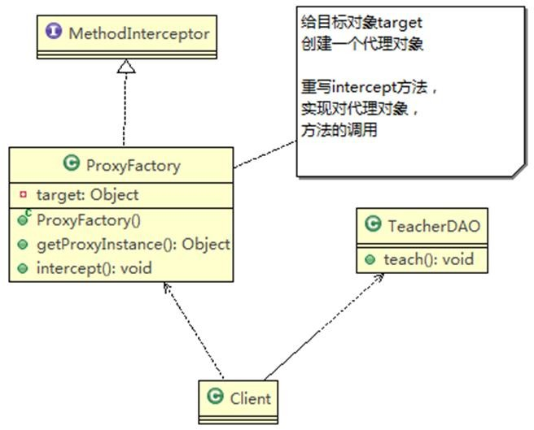
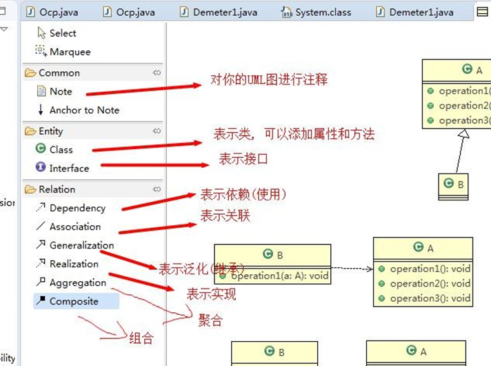
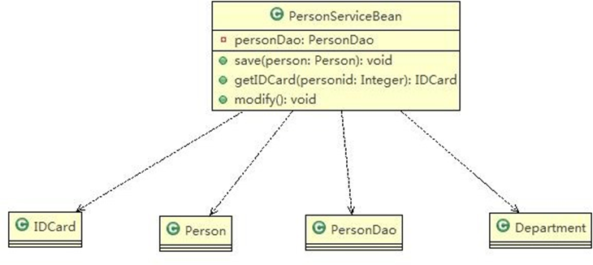
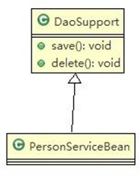
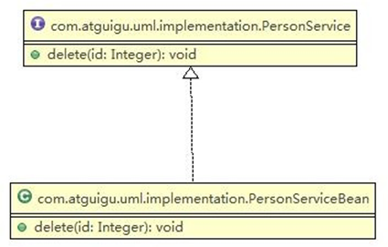
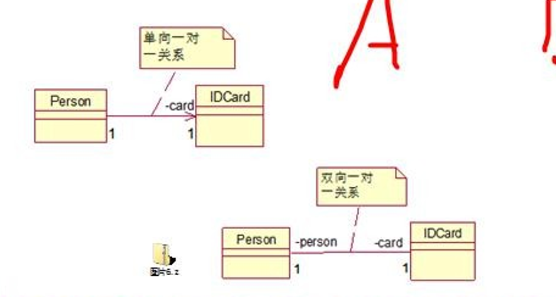
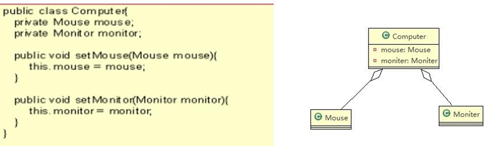
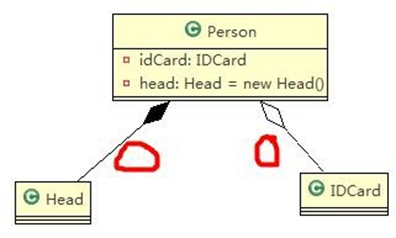

[TOC]
# UML基本介绍
1. UML——Unified modeling language UML (统一建模语言)，是一种用于软件系统分析和设计的语言工具，它用于帮助软件开发人员进行思考和记录思路的结果
2. UML 本身是一套符号的规定，就像数学符号和化学符号一样，这些符号用于描述软件模型中的各个元素和他们之间的关系，比如类、接口、实现、泛化、依赖、组合、聚合等，如右图:


## UML图
画 UML 图与写文章差不多，都是把自己的思想描述给别人看，关键在于思路和条理，UML 图分类：

1. 用例图(use case)
2. 静态结构图：`类图`、对象图、包图、组件图、部署图
2. 动态行为图：交互图（时序图与协作图）、状态图、活动图

## UML类图
1. 用于描述系统中的类(对象)本身的组成和类(对象)之间的各种静态关系。
2. 类之间的关系：依赖、泛化（继承）、实现、关联、聚合与组合。

### 依赖（Dependence）
只要是在类中用到了对方，那么他们之间就存在依赖关系。如果没有对方，连编绎都通过不了。

```java
class PersonServiceBean {
    private PersonDao personDao;

    public void sava(PersonDao personDao){
        this.personDao = personDao;
    }

    public IDcard getIDCard(Integer personId) {
        return null;
    } 
    
    public void modify(){
        Department department = new Department();    
    }
}

class PersonDao{}
class IDCard{}
class Person{}
class Department{}
```
对应的类图


* 类中用到了对方
* 如果是类的成员属性
* 如果是方法的返回类型
* 是方法接收的参数类型
* 方法中使用到

### 泛化关系（Generalization）
泛化关系实际上就是继承关系，他是依赖关系的特例
```java
public abstract class DaoSupport{ 

    public void save(Object entity){
    }

    public void delete(Object id){
    }

}


public class PersonServiceBean extends Daosupport{
}

```

### 实现关系
实现关系就是实现接口，它也是依赖关系的特例
```java
public interface PersonService { 
    
    public void delete(Interger id);

}

public class PersonServiceBean implements PersonService { 

    public void delete(Interger id){}

}
```

### 关联关系
* 关联关系实际上就是类与类之间的联系，是依赖关系的特例
* 以来具有导航性，有双向关系和单向关系
1. 单向关联关系
```java
public class Person{
    private IDCard card;
}
```
2. 双向关联关系

```java
public class Person{
    private IDCard card;
}

public class IDCard{
    private Person person;
}
```


### 聚合关系

   聚合关系（Aggregation）表示的是`整体和部分的关系，整体与部分可以分开`。聚合关系是关联关系的特例，所以他具有关联的导航性与多重性。
   如：一台电脑由键盘(keyboard)、显示器(monitor)，鼠标等组成；组成电脑的各个配件是可以从电脑上分离出来的，使用带空心菱形的实线来表示：

### 组合关系
组合关系：也是整体与部分的关系，但是整体与部分不可以分开。
再看一个案例：在程序中我们定义实体：Person 与 IDCard、Head, 那么 Head 和 Person 就是 组合，IDCard 和
Person 就是聚合。

但是如果在程序中 Person 实体中定义了对 IDCard 进行级联删除，即删除 Person 时连同 IDCard 一起删除，那么 IDCard  和 Person 就是组合了.

```java
public class Person{ 

    private IDCard card;

    private Head head = new Head();
}

public class IDCard{} 

public class Head{}

```

