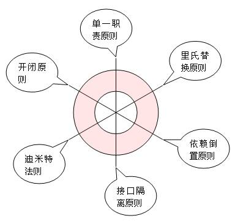
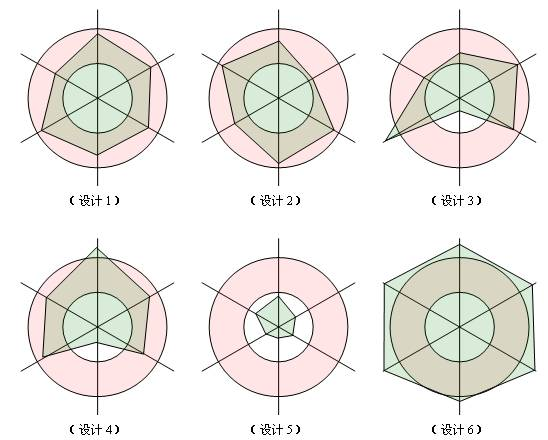

# 开闭原则
## 基本介绍
1. 开闭原则（Open Closed Principle）是编程中最基础、最重要的设计原则
2. 一个软件实体如类，模块和函数应该`对扩展开放(对提供方)，对修改关闭(对使用方)。用抽象构建框架，用实现扩展细节`。
3. `当软件需要变化时，尽量通过扩展软件实体的行为来实现变化，而不是通过修改已有的代码来实现变化`。
4. 编程中遵循其它原则，以及使用设计模式的目的就是遵循开闭原则。
5. 我们遵循设计模式前面5大原则，以及使用23种设计模式的目的就是遵循开闭原则。也就是说，只要我们对前面5项原则遵守的好了，设计出的软件自然是符合开闭原则的，这个开闭原则更像是前面五项原则遵守程度的“平均得分”，前面5项原则遵守的好，平均分自然就高，说明软件设计开闭原则遵守的好；如果前面5项原则遵守的不好，则说明开闭原则遵守的不好。
6. 开闭原则无非就是想表达这样一层意思：用抽象构建框架，用实现扩展细节。因为抽象灵活性好，适应性广，只要抽象的合理，可以基本保持软件架构的稳定。而软件中易变的细节，我们用从抽象派生的实现类来进行扩展，当软件需要发生变化时，我们只需要根据需求重新派生一个实现类来扩展就可以了。当然前提是我们的抽象要合理，要对需求的变更有前瞻性和预见性才行。
7. 前面说的5项原则，恰恰是告诉我们用抽象构建框架，用实现扩展细节的注意事项而已：单一职责原则告诉我们实现类要职责单一；里氏替换原则告诉我们不要破坏继承体系；依赖倒置原则告诉我们要面向接口编程；接口隔离原则告诉我们在设计接口的时候要精简单一；迪米特法则告诉我们要降低耦合。而开闭原则是总纲，他告诉我们要对扩展开放，对修改关闭。
8.  最后说明一下如何去遵守这六个原则。对这六个原则的遵守并不是是和否的问题，而是多和少的问题，也就是说，我们一般不会说有没有遵守，而是说遵守程度的多少。任何事都是过犹不及，设计模式的六个设计原则也是一样，制定这六个原则的目的并不是要我们刻板的遵守他们，而需要根据实际情况灵活运用。对他们的遵守程度只要在一个合理的范围内，就算是良好的设计。

 图中的每一条维度各代表一项原则，我们依据对这项原则的遵守程度在维度上画一个点，则如果对这项原则遵守的合理的话，这个点应该落在红色的同心圆内部；如果遵守的差，点将会在小圆内部；如果过度遵守，点将会落在大圆外部。一个良好的设计体现在图中，应该是六个顶点都在同心圆中的六边形。

在上图中，设计1、设计2属于良好的设计，他们对六项原则的遵守程度都在合理的范围内；设计3、设计4设计虽然有些不足，但也基本可以接受；设计5则严重不足，对各项原则都没有很好的遵守；而设计6则遵守过渡了，设计5和设计6都是迫切需要重构的设计。
