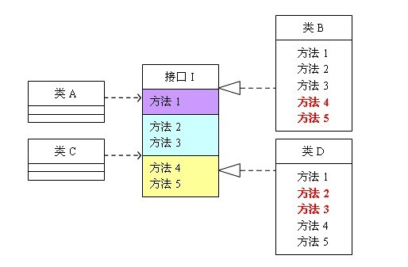

[TOC]
# 接口隔离原则
## 定义
客户端不应该依赖它不需要的接口；即一个类对另一个类的依赖应该建立在最小的接口上
## 实例说明
### 问题描述
类A通过接口I依赖类B，类C通过接口I依赖类D，如果接口I对于类A和类B来说不是最小接口，那么类B和类D就要实现接口I中的所有方法，其中包括类A和类B不需要的方法。

在上图中，类A依赖接口I中的方法1、方法2、方法3，类B是对类A依赖的实现。类C依赖接口I中的方法1、方法4、方法5，类D是对类C依赖的实现。对于类B和类D来说，虽然他们都存在着用不到的方法（也就是图中红色字体标记的方法），但由于实现了接口I，所以也必须要实现这些用不到的方法。对类图不熟悉的可以参照程序代码来理解，代码如下：
```java
interface I {
	public void method1();
	public void method2();
	public void method3();
	public void method4();
	public void method5();
}
 
class A{
	public void depend1(I i){
		i.method1();
	}
	public void depend2(I i){
		i.method2();
	}
	public void depend3(I i){
		i.method3();
	}
}
 
class B implements I{
	public void method1() {
		System.out.println("类B实现接口I的方法1");
	}
	public void method2() {
		System.out.println("类B实现接口I的方法2");
	}
	public void method3() {
		System.out.println("类B实现接口I的方法3");
	}
	//对于类B来说，method4和method5不是必需的，但是由于接口A中有这两个方法，
	//所以在实现过程中即使这两个方法的方法体为空，也要将这两个没有作用的方法进行实现。
	public void method4() {}
	public void method5() {}
}
 
class C{
	public void depend1(I i){
		i.method1();
	}
	public void depend2(I i){
		i.method4();
	}
	public void depend3(I i){
		i.method5();
	}
}
 
class D implements I{
	public void method1() {
		System.out.println("类D实现接口I的方法1");
	}
	//对于类D来说，method2和method3不是必需的，但是由于接口A中有这两个方法，
	//所以在实现过程中即使这两个方法的方法体为空，也要将这两个没有作用的方法进行实现。
	public void method2() {}
	public void method3() {}
 
	public void method4() {
		System.out.println("类D实现接口I的方法4");
	}
	public void method5() {
		System.out.println("类D实现接口I的方法5");
	}
}
 
public class Client{
	public static void main(String[] args){
		A a = new A();
		a.depend1(new B());
		a.depend2(new B());
		a.depend3(new B());
		
		C c = new C();
		c.depend1(new D());
		c.depend2(new D());
		c.depend3(new D());
	}
}
```
### 改进设计
由于接口I的中方法过多，在类B和类D中必须都要实现接口I中所有的方法。因此，应该使用接口隔离原则将接口I进行拆分，将接口I拆分为几个接口，使类B和类D只需要实现特定的接口去实现类A和类C所需要的方法，而不是一个庞大臃肿的接口I，拆分后的设计如下。


```java
interface I1 {
	public void method1();
}
 
interface I2 {
	public void method2();
	public void method3();
}
 
interface I3 {
	public void method4();
	public void method5();
}
 
class A{
	public void depend1(I1 i){
		i.method1();
	}
	public void depend2(I2 i){
		i.method2();
	}
	public void depend3(I2 i){
		i.method3();
	}
}
 
class B implements I1, I2{
	public void method1() {
		System.out.println("类B实现接口I1的方法1");
	}
	public void method2() {
		System.out.println("类B实现接口I2的方法2");
	}
	public void method3() {
		System.out.println("类B实现接口I2的方法3");
	}
}
 
class C{
	public void depend1(I1 i){
		i.method1();
	}
	public void depend2(I3 i){
		i.method4();
	}
	public void depend3(I3 i){
		i.method5();
	}
}
 
class D implements I1, I3{
	public void method1() {
		System.out.println("类D实现接口I1的方法1");
	}
	public void method4() {
		System.out.println("类D实现接口I3的方法4");
	}
	public void method5() {
		System.out.println("类D实现接口I3的方法5");
	}
}
```

## 注意事项
1. 接口隔离原则的含义：建立单一接口，不要建立庞大臃肿的接口，接口中的方法应该尽量少。应该为每个类设计专门的接口，而不是设计一个庞大的接口去供所有类去实现。
2. 单一职责原则主要是约束类，其次是接口和方法；接口隔离原则主要是约束接口，主要是抽象的，针对程序整体框架的构建。
3. 对接口进行约束的时候应该注意以下几点：
* 接口尽量小但是要有限度，对接口进行适当的细化可以提高程序设计的灵活度，但是如果接口中的方法过小就会使得类实现的接口数量过多，增加设计的复杂。
* 为依赖接口的类提供定制服务，只暴露给调用的类它需要的方法，它不需要的要隐藏起来.
* 提高内聚，减少对外交互，是接口用最少的方法完成最多的事情。

`运用接口隔离原则，一定要适度，接口设计的过大和过小都不好，要多花时间思考和筹划。`