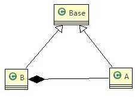

[TOC]
# 里氏替换原则
## 基本介绍：
1. 里氏替换原则是1988年，麻省理工学院的一名姓里的女士提出的。
2. 如果对每个类型为 T1 的对象 o1，都有类型为 T2 的对象 o2，使得以 T1 定义的所有程序 P 在所有的对象 o1 都代换成 o2 时，程序 P 的行为没有发生变化，那么类型 T2 是类型 T1 的子类型。换句话说，所有引用基类的地方必须能透明地使用其子类的对象。
3. 在使用继承时，遵循里氏替换原则，`在子类中尽量不要重写父类的方法`。
4. 继承实际上让两个类耦合性增强了，在适当的情况下，可以`通过聚合、组合、依赖来解决问题`。

    继承包含这样一层含义：父类中凡是已经实现好的方法（相对于抽象方法而言），实际上是在设定一系列的规范和契约，虽然它不强制要求所有的子类必须遵从这些契约，但是如果子类对这些非抽象方法任意修改，就会对整个继承体系造成破坏。而里氏替换原则就是表达了这一层含义。
      继承作为面向对象三大特性之一，在给程序设计带来巨大便利的同时，也带来了弊端。比如使用继承会给程序带来侵入性，程序的可移植性降低，增加了对象间的耦合性，如果一个类被其他的类所继承，则当这个类需要修改时，必须考虑到所有的子类，并且父类修改后，所有涉及到子类的功能都有可能会产生故障。

## 实例说明
```java
// A 类
class A {
// 返回两个数的差
    public int func1(int num1, int num2) { 
        return num1 - num2;
    }
}

// B 类继承了 A
// 增加了一个新功能：完成两个数相加,然后和 9 求和
class B extends A {
//这里，重写了 A 类的方法,  可能是无意识
    public int func1(int a, int b) { 
        return a + b;
    }

    public int func2(int a, int b) { 
        return func1(a, b) + 9;
    }
}
```
### 解决方案
1. 我们发现原来运行正常的相减功能发生了错误。原因就是类 B 无意中重写了父类的方法，造成原有功能出现错误。在实际编程中，我们常常会通过重写父类的方法完成新的功能，这样写起来虽然简单，但整个继承体系的复用性会比较差。特别是运行多态比较频繁的时候。
2. 通用的做法是：原来的父类和子类都继承一个更通俗的基类，原有的继承关系去掉，采用依赖，聚合，组合等关系代替.


```java
//创建一个更加基础的基类 
//把更加基础的方法和成员写到Base类
class Base {

}
// A 类
class A extends Base {
// 返回两个数的差
    public int func1(int num1, int num2) { 
        return num1 - num2;
    }
}

// B 类继承了 A
// 增加了一个新功能：完成两个数相加,然后和 9 求和
class B extends Base {
//如果 B 需要使用 A 类的方法,使用组合关系
private A a = new A();

//这里，重写了 A 类的方法,  可能是无意识
    public int func1(int a, int b) { 
        return a + b;
    }


    public int func2(int a, int b) { 
        return func1(a, b) + 9;
    }

    //我们仍然想使用 A 的方法
    public int func3(int a, int b) { 
        return this.a.func1(a, b);
    }
}

```

## 注意事项
里氏替换原则通俗的来讲就是：子类可以扩展父类的功能，但不能改变父类原有的功能。它包含以下4层含义：

* 子类可以实现父类的抽象方法，但不能覆盖父类的非抽象方法。
* 子类中可以增加自己特有的方法。
* 当子类的方法重载父类的方法时，方法的前置条件（即方法的形参）要比父类方法的输入参数更宽松。
* 当子类的方法实现父类的抽象方法时，方法的后置条件（即方法的返回值）要比父类更严格。
    看上去很不可思议，因为我们会发现在自己编程中常常会违反里氏替换原则，程序照样跑的好好的。所以大家都会产生这样的疑问，假如我非要不遵循里氏替换原则会有什么后果？

`后果就是：你写的代码出问题的几率将会大大增加。`
