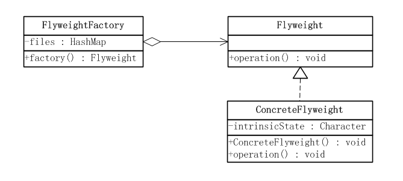
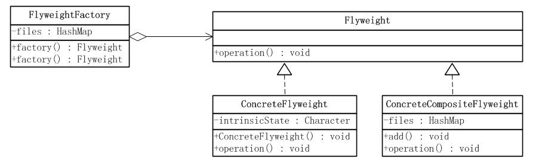

# 享元模式

## 动机

**面向对象技术可以很好地解决一些灵活性或可扩展性问题，但在很多情况下需要在系统中增加类和对象的个数。当对象数量太多时，将导致运行代价过高，带来性能下降等问题。享元模式正是为解决这一类问题而诞生的。**享元模式通过共享技术实现相同或相似对象的重用，示意图如下(我们可以共用一个 Hello world 对象，其中字符串 “Hello world” 为内部状态，可共享；字体颜色为外部状态，不可共享，由客户端设定)：


在享元模式中可以共享的相同内容称为** 内部状态(**Intrinsic State)，而那些需要外部环境来设置的不能共享的内容称为 **外部状态**(Extrinsic State)，其中外部状态和内部状态是相互独立的，外部状态的变化不会引起内部状态的变化。**由于区分了内部状态和外部状态，因此可以通过设置不同的外部状态使得相同的对象可以具有一些不同的特征，而相同的内部状态是可以共享的。**也就是说，享元模式的本质是分离与共享 ： 分离变与不变，并且共享不变。把一个对象的状态分成内部状态和外部状态，内部状态即是不变的，外部状态是变化的；然后通过共享不变的部分，达到减少对象数量并节约内存的目的。

　　在享元模式中通常会出现工厂模式，需要创建一个享元工厂来负责维护一个享元池(Flyweight Pool)（用于存储具有相同内部状态的享元对象）。在享元模式中，共享的是享元对象的内部状态，外部状态需要通过环境来设置。在实际使用中，能够共享的内部状态是有限的，因此享元对象一般都设计为较小的对象，它所包含的内部状态较少，这种对象也称为 细粒度对象。
享元模式的目的就是使用共享技术来实现大量细粒度对象的复用。


## 定义

享元模式(Flyweight Pattern)：运用共享技术有效地支持大量细粒度对象的复用。系统只使用少量的对象，而这些对象都很相似，状态变化很小，可以实现对象的多次复用。**由于 享元模式要求能够共享的对象必须是细粒度对象，因此它又称为轻量级模式，它是一种 对象结构型模式。**


**Flyweight：** 享元接口，通过这个接口传入外部状态并作用于外部状态；
**ConcreteFlyweight：** 具体的享元实现对象，必须是可共享的，需要封装享元对象的内部状态；
**UnsharedConcreteFlyweight**： 非共享的享元实现对象，并不是所有的享元对象都可以共享，非共享的享元对象通常是享元对象的组合对象；
**FlyweightFactory：** 享元工厂，主要用来创建并管理共享的享元对象，并对外提供访问共享享元的接口；




**变种：**
**单纯享元模式：**在单纯享元模式中，所有的享元对象都是可以共享的，即所有抽象享元类的子类都可共享，不存在非共享具体享元类。


## 实例一：单纯享元模式


```java
//抽象享元角色类
public interface Flyweight {
    //一个示意性方法，参数state是外蕴状态
    public void operation(String state);
}

//具体享元角色类
//具体享元角色类ConcreteFlyweight有一个内蕴状态，在本例中一个Character类型的intrinsicState属性代表，它的值应当在享元对象
//被创建时赋予。所有的内蕴状态在对象创建之后，就不会再改变了。如果一个享元对象有外蕴状态的话，所有的外部状态都必须存储在客户端，
//在使用享元对象时，再由客户端传入享元对象。这里只有一个外蕴状态，operation()方法的参数state就是由外部传入的外蕴状态。
public class ConcreteFlyweight implements Flyweight {

    private Character intrinsicState = null;
    /**
     * 构造函数，内蕴状态作为参数传入
     * @param state
     */
    public ConcreteFlyweight(Character state){
        this.intrinsicState = state;
    }


    /**
     * 外蕴状态作为参数传入方法中，改变方法的行为，
     * 但是并不改变对象的内蕴状态。
     */
    @Override
    public void operation(String state) {
        // TODO Auto-generated method stub
        System.out.println("Intrinsic State = " + this.intrinsicState);
        System.out.println("Extrinsic State = " + state);
    }

}


//享元工厂角色类
//享元工厂角色类，必须指出的是，**客户端不可以直接将具体享元类实例化，而必须通过一个工厂对象**，利用一个factory()方法得到享元对象。
//一般而言，享元工厂对象在整个系统中只有一个，因此也可以使用单例模式。
//当客户端需要单纯享元对象的时候，需要调用享元工厂的factory()方法，并传入所需的单纯享元对象的内蕴状态，由工厂方法产生所需要的
//享元对象。
public class FlyweightFactory {
    private Map<Character,Flyweight> files = new HashMap<Character,Flyweight>();

    public Flyweight factory(Character state){
        //先从缓存中查找对象
        Flyweight fly = files.get(state);
        if(fly == null){
            //如果对象不存在则创建一个新的Flyweight对象
            fly = new ConcreteFlyweight(state);
            //把这个新的Flyweight对象添加到缓存中
            files.put(state, fly);
        }
        return fly;
    }
}


//客户端类
public class Client {

    public static void main(String[] args) {
        // TODO Auto-generated method stub
        FlyweightFactory factory = new FlyweightFactory();
        Flyweight fly = factory.factory(new Character('a'));
        fly.operation("First Call");

        fly = factory.factory(new Character('b'));
        fly.operation("Second Call");

        fly = factory.factory(new Character('a'));
        fly.operation("Third Call");
    }

}
```
**虽然客户端申请了三个享元对象，但是实际创建的享元对象只有两个，这就是共享的含义。**运行结果如下：


## 复合享元模式

复合享元模式：将一些单纯享元使用组合模式加以组合，可以形成复合享元对象，这样的复合享元对象本身不能共享，但是它们可以分解成单纯享元对象，而后者则可以共享。


```java

//抽象享元角色类
public interface Flyweight {
    //一个示意性方法，参数state是外蕴状态
    public void operation(String state);
}


//具体享元角色类
//具体享元角色类ConcreteFlyweight有一个内蕴状态，在本例中一个Character类型的intrinsicState属性代表，它的值应当在享元对象
//被创建时赋予。所有的内蕴状态在对象创建之后，就不会再改变了。如果一个享元对象有外蕴状态的话，所有的外部状态都必须存储在客户端，
//在使用享元对象时，再由客户端传入享元对象。这里只有一个外蕴状态，operation()方法的参数state就是由外部传入的外蕴状态。
public class ConcreteFlyweight implements Flyweight {
    private Character intrinsicState = null;
    /**
     * 构造函数，内蕴状态作为参数传入
     * @param state
     */
    public ConcreteFlyweight(Character state){
        this.intrinsicState = state;
    }


    /**
     * 外蕴状态作为参数传入方法中，改变方法的行为，
     * 但是并不改变对象的内蕴状态。
     */
    @Override
    public void operation(String state) {
        // TODO Auto-generated method stub
        System.out.println("Intrinsic State = " + this.intrinsicState);
        System.out.println("Extrinsic State = " + state);
    }

}


//复合享元角色类
//复合享元对象是由单纯享元对象通过复合而成的，因此它提供了add()这样的聚集管理方法。由于一个复合享元对象具有不同的聚集元素，
//这些聚集元素在复合享元对象被创建之后加入，这本身就意味着复合享元对象的状态是会改变的，因此复合享元对象是不能共享的。
//复合享元角色实现了抽象享元角色所规定的接口，也就是operation()方法，这个方法有一个参数，代表复合享元对象的外蕴状态。
//一个复合享元对象的所有单纯享元对象元素的外蕴状态都是与复合享元对象的外蕴状态相等的；
//而一个复合享元对象所含有的单纯享元对象的内蕴状态一般是不相等的，不然就没有使用价值了。
public class ConcreteCompositeFlyweight implements Flyweight {

    private Map<Character,Flyweight> files = new HashMap<Character,Flyweight>();
    /**
     * 增加一个新的单纯享元对象到聚集中
     */
    public void add(Character key , Flyweight fly){
        files.put(key,fly);
    }
    /**
     * 外蕴状态作为参数传入到方法中
     */
    @Override
    public void operation(String state) {
        Flyweight fly = null;
        for(Object o : files.keySet()){
            fly = files.get(o);
            fly.operation(state);
        }

    }

}


//享元工厂角色类
//享元工厂角色提供两种不同的方法，一种用于提供单纯享元对象，另一种用于提供复合享元对象。
public class FlyweightFactory {
    private Map<Character,Flyweight> files = new HashMap<Character,Flyweight>();
    /**
     * 复合享元工厂方法
     */
    public Flyweight factory(List<Character> compositeState){
        ConcreteCompositeFlyweight compositeFly = new ConcreteCompositeFlyweight();

        for(Character state : compositeState){
            compositeFly.add(state,this.factory(state));
        }

        return compositeFly;
    }
    /**
     * 单纯享元工厂方法
     */
    public Flyweight factory(Character state){
        //先从缓存中查找对象
        Flyweight fly = files.get(state);
        if(fly == null){
            //如果对象不存在则创建一个新的Flyweight对象
            fly = new ConcreteFlyweight(state);
            //把这个新的Flyweight对象添加到缓存中
            files.put(state, fly);
        }
        return fly;
    }
}


//客户端类
public class Client {

    public static void main(String[] args) {
        List<Character> compositeState = new ArrayList<Character>();
        compositeState.add('a');
        compositeState.add('b');
        compositeState.add('c');
        compositeState.add('a');
        compositeState.add('b');

        FlyweightFactory flyFactory = new FlyweightFactory();
        Flyweight compositeFly1 = flyFactory.factory(compositeState);
        Flyweight compositeFly2 = flyFactory.factory(compositeState);
        compositeFly1.operation("Composite Call");

        System.out.println("---------------------------------");        
        System.out.println("复合享元模式是否可以共享对象：" + (compositeFly1 == compositeFly2));

        Character state = 'a';
        Flyweight fly1 = flyFactory.factory(state);
        Flyweight fly2 = flyFactory.factory(state);
        System.out.println("单纯享元模式是否可以共享对象：" + (fly1 == fly2));
    }
}
```


享元模式与其他模式的联用

　　在享元模式的享元工厂类中通常提供一个静态的工厂方法用于返回享元对象，使用 简单工厂模式来生成享元对象；

　　在一个系统中，通常只有唯一一个享元工厂，因此享元工厂类可以使用单例模式进行设计；

**　　享元模式可以结合组合模式形成复合享元模式，统一对享元对象设置外部状态。
**

## 分析

    享元模式是一个 考虑系统性能的设计模式，通过使用享元模式可以节约内存空间，提高系统的性能。

    享元模式的核心在于享元工厂类，享元工厂类的作用在于提供一个用于存储享元对象的享元池，用户需要对象时，首先从享元池中获取，如果享元池中不存在，则创建一个新的享元对象返回给用户，并在享元池中保存该新增对象。


典型的享元工厂类代码：
```java
public class FlyweightFactory
{
    private HashMap flyweights = new HashMap();

    public Flyweight getFlyweight(String key)
    {
        if(flyweights.containsKey(key))
        {
            return (Flyweight)flyweights.get(key);
        }
        else
        {
            Flyweight fw = new ConcreteFlyweight();
            flyweights.put(key,fw);
            return fw;
        }
    }
} 
```

享元模式以共享的方式高效地支持大量的细粒度对象，享元对象能做到共享的关键是区分内部状态(Internal State)和外部状态(External State)。其中：

内部状态 是存储在享元对象内部并且不会随环境改变而改变的状态，因此内部状态可以共享。
外部状态 是随环境改变而改变的、不可以共享的状态。享元对象的外部状态必须由客户端保存，并在享元对象被创建之后，在需要使用的时候再传入到享元对象内部。一个外部状态与另一个外部状态之间是相互独立的。


典型的享元类代码：
```java
public class Flyweight
{
        //内部状态作为成员属性
    private String intrinsicState;

    public Flyweight(String intrinsicState)
    {
        this.intrinsicState = intrinsicState;
    }

    public void operation(String extrinsicState)
    {
        ......
    }   
}
```

## 模式的应用

享元模式在编辑器软件中大量使用，如在一个文档中多次出现相同的图片，则只需要创建一个图片对象，通过在应用程序中设置该图片出现的位置，可以实现该图片在不同地方多次重复显示。

广义上讲，在JDK类库中定义的String类也是使用享元模式的典型。

## 总结

**1、模式适用环境**
　　
在以下情况下可以使用享元模式：

一个系统有大量相同或者相似的对象，由于这类对象的大量使用，造成内存的大量耗费；
对象的大部分状态都可以外部化，可以将这些外部状态传入对象中(细粒度对象)；
使用享元模式需要维护一个存储享元对象的享元池，而这需要耗费资源，因此，应当在多次重复使用享元对象时才值得使用享元模式。

**2、模式的优点**

　　（1）它可以极大减少内存中对象的数量，使得相同对象或相似对象在内存中只保存一份；
　　（2）享元模式的外部状态相对独立，而且不会影响其内部状态，从而使得享元对象可以在不同的环境中被共享。

**3、模式的缺点**

　　（1）享元模式使得系统更加复杂，需要分离出内部状态和外部状态，这使得程序的逻辑复杂化；
　　（2）为了使对象可以共享，享元模式需要将享元对象的状态外部化，而读取外部状态使得运行时间变长。

**4、模式的实现**

享元模式运用共享技术有效地支持大量 细粒度对象的复用。系统只使用少量的对象，而这些对象都很相似，状态变化很小，可以实现对象的多次复用，它是一种对象结构型模式。

享元模式包含四个角色：抽象享元类声明一个接口，通过它可以接受并作用于外部状态；具体享元类实现了抽象享元接口，其实例称为享元对象；非共享具体享元是不能被共享的抽象享元类的子类；享元工厂类用于创建并管理享元对象，它针对抽象享元类编程，将各种类型的具体享元对象存储在一个享元池中。

享元模式以共享的方式高效地支持大量的细粒度对象，享元对象能做到共享的关键是区分内部状态和外部状态。其中内部状态是存储在享元对象内部并且不会随环境改变而改变的状态，因此内部状态可以共享；外部状态是随环境改变而改变的、不可以共享的状态。
