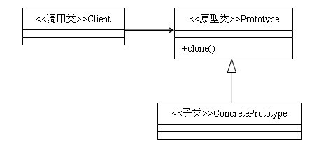
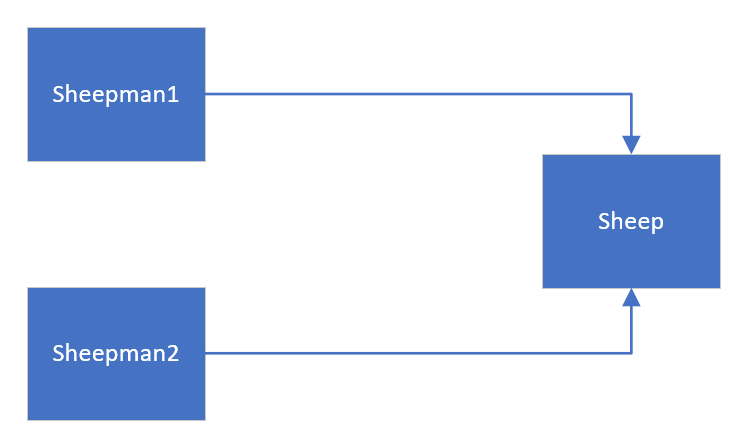

[TOC]
# 原型模式

## 定义
用原型实例指定创建对象的种类，并通过拷贝这些原型创建新的对象，属于创建者模式类型。

## 作用和实现

原型模式主要用于对象的复制，它的核心是就是类图中的原型类Prototype。Prototype类需要具备以下两个条件：

* 实现Cloneable接口。Cloneable接口的作用是在运行时通知虚拟机可以安全运行实现了此接口的类的clone（）方法。即，只有实现了这个接口的对象才可以被拷贝，否则在运行时会抛出CloneNotSupportException异常。
* 重写Object类中的clone（）方法，此方法的作用域是protedted类型，一般的类无法使用，因此，Prototype类需要将clone的作用域修改为public类型。


## 案例

### 问题描述

克隆羊问题：现在有一只羊 tom，姓名为: tom, 年龄为：1，请编写程序创建和 tom 羊 属性完全相同的 4只羊。

### 方案一

使用传统的方式创建，创建一个🐏类，然后再主程序中new4只一样的羊，优点是简单、好理解，缺点是效率低，需要动态初始化对象。

```java
public class Sheep {

    private String name;
    private int age;

    public Sheep(String name, int age) {
        this.name = name;
        this.age = age;
    }

    @Override
    public String toString() {
        return "Sheep{" +
                "name='" + name + '\'' +
                ", age=" + age +
                '}';
    }

}

public class Main {
    
    public static void main(String[] args) {
        Sheep sheep1 = new Sheep("tom",1);
        Sheep sheep2 = new Sheep("tom",1);
        Sheep sheep3 = new Sheep("tom",1);
        Sheep sheep4 = new Sheep("tom",1);
    }
}
```

### 方案二

使用原型模式，让Sheep类实现Cloneable接口并重写clone方法，通过调用对象的clone方法实现克隆操作。

```java
public class Sheep implements Cloneable {

    private String name;
    private int age;

    public Sheep(String name, int age) {
        this.name = name;
        this.age = age;
    }

    @Override
    public String toString() {
        return "Sheep{" +
                "name='" + name + '\'' +
                ", age=" + age +
                '}';
    }

    @Override
    public Object clone() {
        Sheep sheep = null;
        try {
            sheep = (Sheep) super.clone();
        } catch (Exception e){
            System.out.println(e.getMessage());
        }
        return sheep;
    }
}

public class Main {

    public static void main(String[] args) {
        Sheep sheep1 = new Sheep("tom",1);
        Sheep sheep2 = (Sheep) sheep1.clone();
        Sheep sheep3 = (Sheep) sheep1.clone();
        Sheep sheep4 = (Sheep) sheep1.clone();
    }
}
```

## 原型模式的优点及使用场景

使用原型模式创建对象比直接new一个对象在性能上要好的多，因为Object类的clone方法是一个本地方法，它直接操作内存中的二进制流，特别是复制大对象时，性能的差别非常明显。

使用原型模式的另一个好处是简化对象的创建，使得创建对象就像我们在编辑文档时的复制粘贴一样简单。

因为以上优点，所以在需要重复地创建相似对象时可以考虑使用原型模式。比如需要在一个循环体内创建对象，假如对象创建过程比较复杂或者循环次数很多的话，使用原型模式不但可以简化创建过程，而且可以使系统的整体性能提高很多。

## 注意事项

* 使用原型模式复制对象不会调用类的构造方法。因为对象的复制是通过调用Object类的clone方法来完成的，它直接在内存中复制数据，因此不会调用到类的构造方法。不但构造方法中的代码不会执行，甚至连访问权限都对原型模式无效。还记得单例模式吗？单例模式中，只要将构造方法的访问权限设置为private型，就可以实现单例。但是clone方法直接无视构造方法的权限，所以，单例模式与原型模式是冲突的，在使用时要特别注意。

* 深拷贝与浅拷贝。Object类的clone方法只会拷贝对象中的基本的数据类型，对于数组、容器对象、引用对象等都不会拷贝，这就是浅拷贝。如果要实现深拷贝，必须将原型模式中的数组、容器对象、引用对象等另行拷贝。

## 深拷贝与浅拷贝


### 浅拷贝

* 对于数据类型是基本数据类型的成员变量，浅拷贝会直接进行值传递，将该属性的属性值复制一份给新的对象。
* 对于数据类型是引用数据类型的成员变量，浅拷贝会进行引用传递，将对象的内存地址复制一份给新的对象，因此，两份对象的引用指向的是同一个对象，在一个对象中修改改成员变量会影响另一个对象的成员变量。
* 前面的使用默认的clone方法是浅拷贝。

### 深拷贝

深拷贝不仅会赋值所有基本数据类型的成员变量值，对于引用数据类型也会将对象在内存中复制一份，即，将引用数据类型的成员变量以及所有的可达对象都在内存中复制一份，而不只是复制内存地址。


实现方法：
* 重写clone方法实现深拷贝
* 通过对象序列化实现深拷贝（推荐）。

### 深拷贝实现克隆羊


```java
//深拷贝中的引用数据类也要实现Cloneable接口和Serializable接口
public class Sheep implements Cloneable,Serializable{

    private String name;
    private int age;

    public Sheep(String name, int age) {
        this.name = name;
        this.age = age;
    }

    @Override
    public String toString() {
        return "Sheep{" +
                "name='" + name + '\'' +
                ", age=" + age +
                '}';
    }

    
    @Override
    public Object clone() {
        Sheep sheep = null;
        try {
            sheep = (Sheep) super.clone();
        } catch (Exception e){
            System.out.println(e.getMessage());
        }
        return sheep;
    }
}

class SheepPerson implements Cloneable, Serializable {
    private String name;

    private Sheep sheep;

    public SheepPerson(String name, Sheep sheep) {
        this.name = name;
        this.sheep = sheep;
    }

    //第一种方法，通过重写clone方法实现深拷贝
    @Override
    public Object clone()  {
        SheepPerson sheepPerson = null;
        try{
            sheepPerson = (SheepPerson) super.clone();
            //将要深拷贝的对象中的引用数据类型的成员变量也进行拷贝。
            sheepPerson.sheep = (Sheep) sheep.clone();
        } catch (Exception e){
            System.out.println(e.getMessage());
        }
        return sheepPerson;
    }

    //方法二，通过对象序列化和反序列化实现深拷贝
    public Object deepClone() {
        ByteArrayOutputStream bos = null;
        ObjectOutputStream oos = null;
        ByteArrayInputStream bis = null;
        ObjectInputStream ois = null;
        try {
            bos = new ByteArrayOutputStream();
            oos = new ObjectOutputStream(bos);
            oos.writeObject(this);
            bis = new ByteArrayInputStream(bos.toByteArray());
            ois = new ObjectInputStream(bis);
            SheepPerson cloneObject = (SheepPerson) ois.readObject();
            return cloneObject;
        } catch (Exception e) {
            e.printStackTrace();
            return null;
        } finally {
            try {
                bos.close();
                oos.close();
                bis.close();
                ois.close();
            } catch (IOException e) {
                e.printStackTrace();
            }

        }
    }
}
```

### 注意事项和细节

* 通过重写clone方法实现深拷贝时，如果对象中有很多引用数据类型的成员变量，要对每一个成员变量都进行拷贝，因此此方法适用于内部引用数据类型的成员变量较少时使用。
* 通过对象序列化实现深拷贝无需拷贝每个成员变量，只需要对this对象序列化与反序列化即可，一劳永逸。
* 当创建新的对象比较复杂是，可以通过原型模式简化对象的创建过程，同时也能提升效率。
* 不用重新初始化对象，而是动态获取运行时的状态，
* 如果原始对象发生变化，其他克隆对象也会发生相应的变化，无需修改代码。
* `缺点`：需要为每一个类重写一个克隆方法，如果要对已有的类进行改造需要修改其源代码，`违背了OCP原则`。


