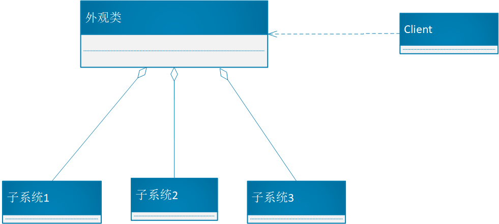
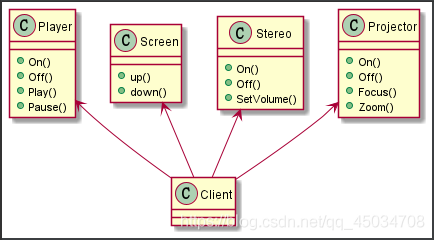
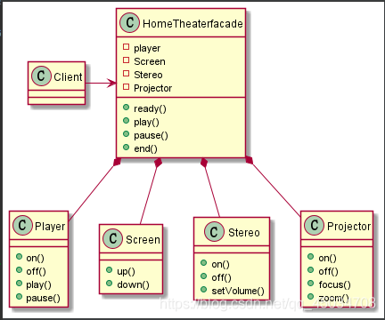
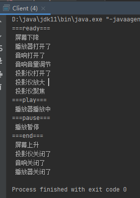

# 外观模式

## 介绍

外观模式 Facade：也叫过程模式，属于结构型模式，外观模式为子系统的一组接口提供一个一致的界面或者接口，此模式顶一个一个高层接口，是的这一子系统更容易使用，

外观模式需要定义一个一致的接口，用以屏蔽内部子系统的细节，使得调用端只需要跟这个接口发生调用，而不需关心这个子系统的内部细节


优点：在保留底层接口布标的前提下，中间层为调用方提供了便利，

**原理类图：**



**外观类：** 为调用者低通统一的调用接口，外观类直到哪些子系统负责处理请求，从而将调用者的请求代理给适当的子系统对象。
**调用者：** 外观接口的调用者，无需知道子系统的具体使用，只需要调用外观类。
**子系统：** 模块或者子系统，处理外观类对象指派的任务，是功能的实际提供者。


## 实例

现在需要组建一个家庭影院，包含设备投影仪、自动屏幕、播放器和音响等。其过程包括放下屏幕、开投影仪、开音响、开播放器，观影结束后，关闭各种设备。

### 实现方法一：
客户端直接使用各个子系统来完成操作：



**存在问题：**
客户端在主函数钟创建各个子系统的对并直接使用其相关方法，造成调用过程混乱，没有清晰的统一过程，也不利于维护子系统的操作。客户端和子系统耦合度高。

解决思路：
定义一个接口界面类，提供一个一致的界面（如提供四个方法ready、play、pause、end）来操作访问各子系统，屏蔽掉子系统的内部细节，使得客户端调用只需要更这个接口发生交互，而无需关心它的内部实现，即->外观模式。


### 实现方法二：

使用外观模式，定义一个高层接口，用来聚合各个子系统，为调用者提供服务。



**子系统：**

```java
public class Player { //播放器
    private static Player instance = new Player();//使用单例模式(饿汉式)
    public static Player getInstanc() {
        return instance;
    }
    public void on() {
        System.out.println(" 播放器打开了 ");
    }
    public void off() {
        System.out.println(" 播放器关闭了 ");
    }
    public void play() {
        System.out.println(" 播放器播放中 ");
    }
    public void pause() {
        System.out.println(" 播放暂停 ");
    }
}

public class Screen { //屏幕
    private static Screen instance = new Screen();
    public static Screen getInstance() {
        return instance;
    }
    public void up() {
        System.out.println(" 屏幕上升 ");
    }
    public void down() {
        System.out.println(" 屏幕下降 ");
    }
}

public class Stereo { //音响
    private static Stereo instance = new Stereo();
    public static Stereo getInstance() {
        return instance;
    }
    public void on() {
        System.out.println(" 音响打开了 ");
    }
    public void off() {
        System.out.println(" 音响关闭了 ");
    }
    public void setVolume() {
        System.out.println(" 音响音量调节 ");
    }
}

public class Projector { //投影仪
    private static Projector instance = new Projector();
    public static Projector getInstance() {
        return instance;
    }
    public void on() {
        System.out.println(" 投影仪打开了 ");
    }
    public void off() {
        System.out.println(" 投影仪关闭了 ");
    }
    public void focus() {
        System.out.println(" 投影仪聚焦 ");
    }
    public void zoom() {
        System.out.println(" 投影仪放大 ");
    }
}
```


**外观类：**

```java
public class HomeTheaterFacade { //外观类
    //定义各个子系统对象
    private Player player;
    private Screen screen;
    private Stereo stereo;
    private Projector projector;

    //构造器
    public HomeTheaterFacade() {
        this.player = Player.getInstance();
        this.screen = Screen.getInstance();
        this.stereo = Stereo.getInstance();
        this.projector = Projector.getInstance();

    }

    //一致界面
    public void ready() {
        System.out.println("===ready===");
        screen.down();
        player.on();
        stereo.on();
        stereo.setVolume();
        projector.on();
        projector.zoom();
        projector.focus();
    }
    public void play() {
        System.out.println("===play===");
        player.play();
    }
    public void pause() {
        System.out.println("===pause===");
        player.pause();
    }
    public void end() {
        System.out.println("===end===");
        screen.up();
        projector.off();
        stereo.off();
        player.off();
    }
}

```

**客户端：**

```java
public class Client {
    public static void main(String[] args) {
        HomeTheaterFacade homeTheaterFacade = new HomeTheaterFacade();
        homeTheaterFacade.ready();
        homeTheaterFacade.play();
        homeTheaterFacade.pause();
        homeTheaterFacade.end();
    }
}

```

