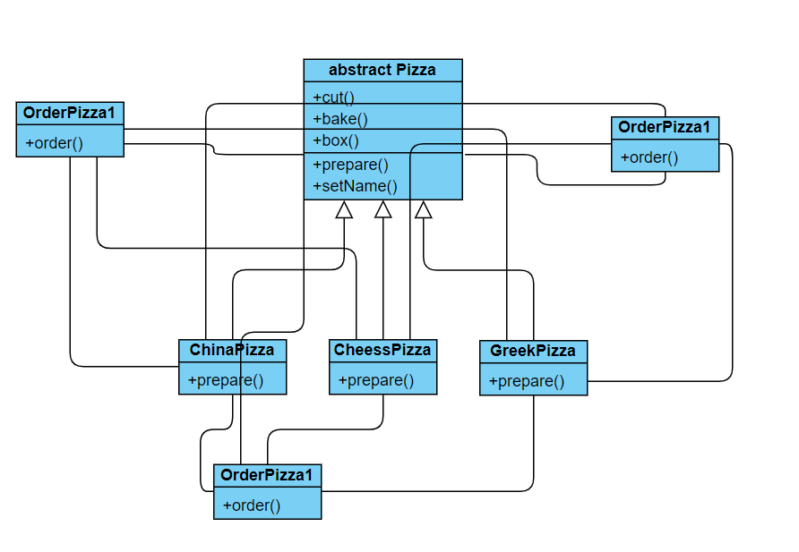
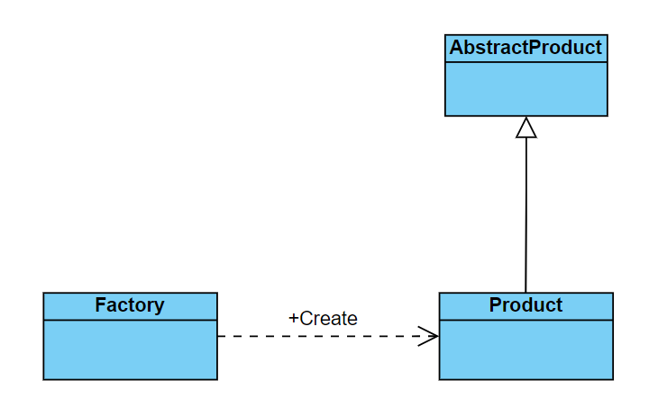
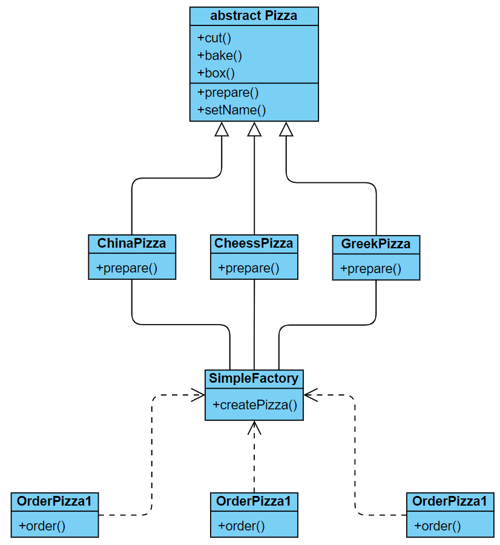
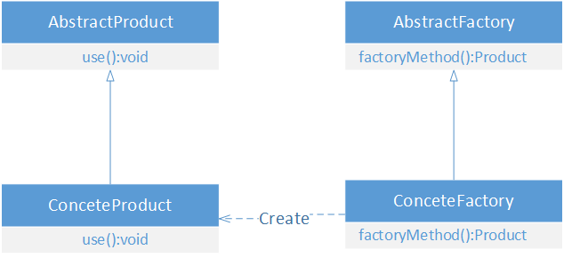
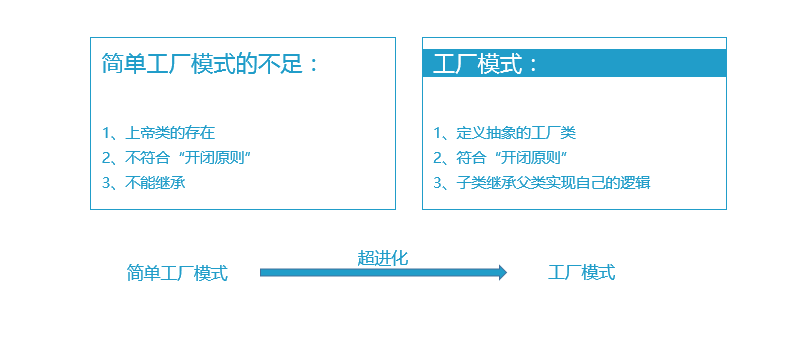
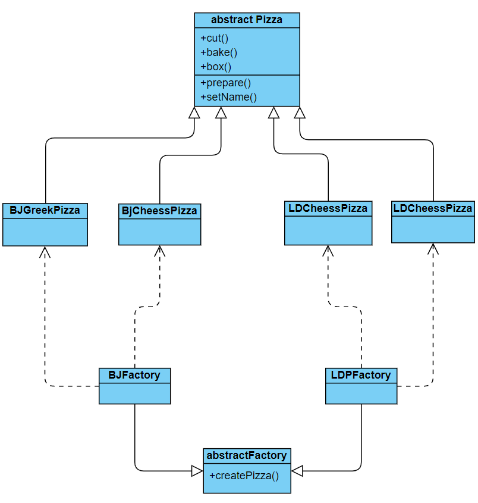
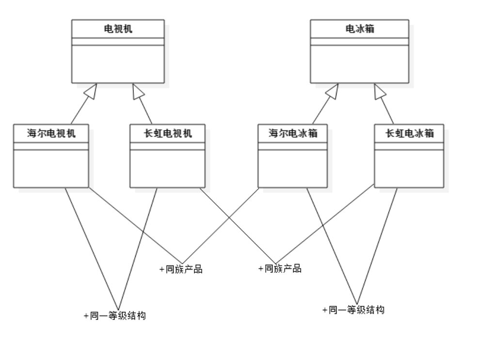
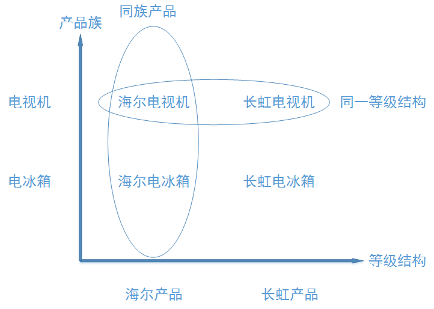
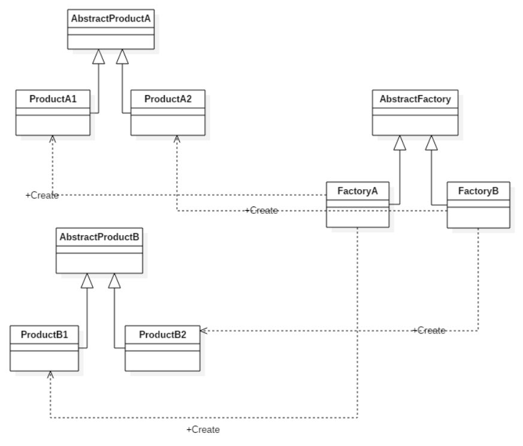

[TOC]
# 工厂模式

使用传统的方式来做

1. 有点事比较好理解，简单易操作。
2. 每一个OrderPizza对象都要依赖所有的Pizza类，不仅在设计上会增加复杂度，而且当增加新的Pizza类时，每个OrderPizza类都要修改已有的代码。
3. 缺点是违反了设计模式的OCP原则，即对扩展开放，对修改关闭。 给类增加新功能的时候，尽量不修改代码，或尽量少修改代码
 

```java
public class OrderPizza {

    public void orderPizza() {
        Pizza pizza = null;
        String orderType;
        do{
            System.out.println("请输入您要点的pizza");
            orderType = getType();
            if ("cheess".equals(orderType)){
                pizza = new CheessPizza();
                pizza.setName("芝士披萨");
            } else if ("Greek".equals(orderType)){
                pizza = new GreekPizza();
                pizza.setName("希腊披萨");
            } else if ("China".equals(orderType)){
                pizza = new ChinaPizza();
                pizza.setName("中国披萨");
            }
            if (pizza != null) {
                pizza.prepare();
                pizza.bake();
                pizza.box();
                pizza.cut();
            }
        }while(true);
    }

    public static String getType(){

            String orderType = null;
            BufferedReader reader = new BufferedReader(new InputStreamReader(System.in));
            try {
                orderType = reader.readLine();
            } catch (IOException e) {
                e.printStackTrace();
            }
            return orderType;
    }
}

public abstract class Pizza {
    String name;
    //准备原材料
    public abstract void prepare();

    //烘焙披萨
    public void bake(){
        System.out.println(name + "开始烘焙");
    }

    public void cut() {
        System.out.println("开始切" + name);
    }

    public void box() {
        System.out.println("开始打包" + name);
    }

    public void setName(String name) {
        this.name = name;
    }
}

class CheessPizza extends Pizza {

    @Override
    public void prepare() {
        System.out.println("准备芝士");
    }
}

class GreekPizza extends Pizza {

    @Override
    public void prepare() {
        System.out.println("准备希腊披萨");
    }
}

class ChinaPizza extends Pizza {


    @Override
    public void prepare() {
        System.out.println("准备中国披萨");
    }
}
```
## 简单工厂模式

### 模式定义 
简单工厂模式(Simple Factory Pattern)：又称为静态工厂方法(Static Factory Method)模式，它属于类创建型模式（同属于创建型模式的还有工厂方法模式，抽象工厂模式，单例模式，建造者模式）。在简单工厂模式中，可以根据参数的不同返回不同类的实例。简单工厂模式专门定义一个类来负责创建其他类的实例，被创建的实例通常都具有共同的父类。
### 模式结构



从上图可以看出，简单工厂模式由三部分组成：具体工厂、具体产品和抽象产品。

* 工厂类（Creator）角色：担任这个角色的是`简单工厂模式的核心`，含有与应用紧密相关的商业逻辑。工厂类`在客户端的直接调用下创建产品对象`，它往往由一个具体Java类实现。

* 抽象产品（AbstractProduct）角色：担任这个角色的类是由简单工厂模式`所创建的对象的父类`，`或它们共同拥有的接口`。抽象产品角色可以用一个Java接口或者Java抽象类实现。

具体产品（ConcreteProduct）角色：简单工厂模式`所创建的任何对象都是这个角色的实例`，具体产品角色由一个具体Java类实现。

### 模式动机
使用简单工厂模式可以将`产品的“消费”和“生产”完全分开`，客户端只需要知道自己需要什么产品，如何来使用产品就可以了，`具体的产品生产任务由具体的工厂类来实现`。工厂类根据传进来的参数生产具体的产品供消费者使用。这种模式使得更加利于扩展，`当有新的产品加入时仅仅需要在工厂中加入新产品的构造就可以了`。

### 创建披萨工厂

```java
public class SimpleFactory {

    public static Pizza createPizza(String orderType) {
        Pizza pizza = null;
        if ("cheess".equals(orderType)){
            pizza = new CheessPizza();
            pizza.setName("芝士披萨");
        } else if ("Greek".equals(orderType)){
            pizza = new GreekPizza();
            pizza.setName("希腊披萨");
        } else if ("China".equals(orderType)){
            pizza = new ChinaPizza();
            pizza.setName("中国披萨");
        }
        return pizza;
    }
}

public class OrderPizza {

    public void orderPizza() {
        Pizza pizza = null;
        String orderType;
        do{
            System.out.println("请输入您要点的pizza");
            orderType = getType();
            pizza = SimpleFactory.createPizza(orderType);
            if (pizza != null) {
                pizza.prepare();
                pizza.bake();
                pizza.box();
                pizza.cut();
            }
        }while(true);
    }

    public static String getType(){

            String orderType = null;
            BufferedReader reader = new BufferedReader(new InputStreamReader(System.in));
            try {
                orderType = reader.readLine();
            } catch (IOException e) {
                e.printStackTrace();
            }
            return orderType;
    }
}
```

### 模式优点

* 简单工厂模式`实现了对责任的分割`，将产品的生产交给工厂类，工厂类直接创建产品，而客户端仅仅消费产品。
* `客户端无需知道具体产品的类名`，只需要知道具体产品对应的参数即可，减少了使用者的记忆量。
* 通过引入配置文件，可以在不修改客户端代码的情况下实现产品的增加和替换，提高了系统的灵活性
* 当需要引入新的产品是不需要修改客户端的代码，只需要添加相应的产品类并修改工厂类就可以了，所以说从产品的角度上简单工厂模式是符合“开-闭”原则的（OCP）。

### 模式缺点
* 工厂类集中了所有产品的创建逻辑，因此被称为"上帝类"，但是一旦出问题整个系统都会受到影响。
* 会增加系统种类的数量，增加了系统的复杂度和理解程度
* 系统扩展困难，一旦增加新产品就要修改工厂逻辑，有可能会造成工厂逻辑过于复杂，不利于系统的扩展和维护，因此，工厂类从工厂的角度时不符合OCP原则的
* 由于使用了静态工厂方法，工厂角色无法形成基于继承的等级结构

### 使用场景
1. 工厂类负责创建的对象比较少时，因为此时工厂类内部的业务逻辑不会太过复杂。
2. 客户端只知道传入工厂类的参数，对于如何创建对象不关心：客户端既不需要关心创建细节，甚至连类名都不需要记住，只需要知道类型所对应的参数。

## 工厂方法模式

又称为工厂模式、虚拟构造器模式、多态工厂模式。首先创建一个抽象工厂父类定义了创建产品的公共方法，由子工厂负责生成具体的产品对象，将产品类的实例化操作延迟到工厂子类中完成。
### 模式结构

分为四个部分：

* 抽象工厂（AbstractCreator）角色：担任这个角色的是工厂方法模式的核心，它是与应用程序无关的。任何在模式中创建对象的工厂类必须继承或者实现这个接口，在实际的系统中，这个角色常常有Java抽象类来实现。
* 具体工厂（ConcreteCreator）角色：担任这个角色的是实现了抽象工厂接口的具体Java类。具体工厂角色含有与应用密切相关的逻辑，并且受到应用程序的调用以创建产品对象。
* 抽象产品（AbstractProduct）角色：工厂方法模式所创建的对象的超类型，也就是产品对象的共同父类或共同拥有的接口。在实际应用中这个角色常常由Java的抽象类来实现。
* 具体产品（ConcreteProduct）角色：这个角色实现了抽象产品角色所声明的接口，工厂方法所创建的每一个对象都是某个具体产品角色的实例。

### 模式动机
1. 解决简单工厂模式“上帝类”的问题，将具体的生产任务放到子类中去
2. 解决简单工厂模式不符合OCP原则的问题
3. 解决简单工厂模式不能继承的问题


### 实例

```java
//抽象工厂类
public abstract class Factory {

    abstract Pizza createPizza(String orderPiza);

    public Factory() {
        System.out.println("初始化");
        Pizza pizza = null;
        String orderType = null;
        do{
            System.out.println("请输入您要点的pizza");
            orderType = getType();
            pizza = createPizza(orderType);
            if (pizza != null) {
                pizza.prepare();
                pizza.bake();
                pizza.box();
                pizza.cut();
            }
        }while(true);
    }

    public static String getType(){

        String orderType = null;
        BufferedReader reader = new BufferedReader(new InputStreamReader(System.in));
        try {
            orderType = reader.readLine();
        } catch (IOException e) {
            e.printStackTrace();
        }
        return orderType;
    }
}

//具体工厂类
public class BJFactory extends Factory {
    @Override
    public Pizza createPizza(String orderPiza) {
        Pizza pizza = null;
        if ("Cheess".equals(orderPiza)){
            pizza = new BJCheessPizza();
            pizza.setName("BJCHEESS");
        } else if ("Greek".equals(orderPiza)){
            pizza = new BJGreekPizza();
            pizza.setName("BJGREEK");
        }
        return pizza;
    }
}
//具体工厂类
public class LDFactory extends Factory {
    @Override
    public Pizza createPizza(String orderPiza) {
        Pizza pizza = null;
        if ("Cheess".equals(orderPiza)){
            pizza = new LDCheessPizza();
            pizza.setName("LDCHEESS");
        } else if ("Greek".equals(orderPiza)){
            pizza = new LDGreekPizza();
            pizza.setName("LDGREEK");
        }
        return pizza;
    }
}
```

### 模式优点

* 用户无需知道具体的产品类名以及具体的实现细节，只需要关心所需产品对应的具体工厂类
* `工厂角色和产品角色的多态性`，所有的具体工厂类都具有同一抽象父类，符合创建对象的细节被完全封装在具体工厂内部
* `在系统加入新的产品时`，无需或者很少修改现有的代码（无需修改抽象工厂和抽象产品接口，无需修改客户端，无需修改其它具体工厂和具体产品），
`只需添加一个具体工厂和具体产品`就可以了，系统的扩展性非常好，`完全符合开闭原则（OCP）`。
* 可以将具体工厂类名存储在配置文件或者数据库中。


### 模式缺点

* 增加新产品需要编写新的具体产品类以及对应的具体工厂类，系统中类的个数将成对增加，增加了系统复杂度
* 由于引入了抽象层，增加了系统的可理解程度，并且还可能用到DOM、反射等技术，增加了系统的实现难度

## 抽象工厂模式

### 模式定义
抽象工厂模式(Abstract Factory Pattern)：提供一个创建一系列相关或相互依赖对象的接口，而无须指定它们具体的类。抽象工厂模式又称为Kit模式，属于对象创建型模式。

### 产品族和等级结构

为了更清晰地理解抽象工厂模式，需要先引入两个概念：

**`产品等级结构`** ：产品等级结构即产品的继承结构，如一个抽象类是电视机，其子类有海尔电视机、海信电视机、TCL电视机，则抽象电

视机与具体品牌的电视机之间构成了一个产品等级结构，抽象电视机是父类，而具体品牌的电视机是其子类。

**`产品族`** ：在抽象工厂模式中，产品族是指由同一个工厂生产的，位于不同产品等级结构中的一组产品，如海尔电器工厂生产的海尔电视

机、海尔电冰箱，海尔电视机位于电视机产品等级结构中，海尔电冰箱位于电冰箱产品等级结构中。

从上边的图中我们可以更清晰的看到同族产品和同一等级结构的产品的联系和区别。海尔电视机和长虹电视机都是电视机的子类，这样的关系叫做`同一等级结构`；海尔电视机和海尔电冰箱都是海尔公司生产的产品，所以他们都是`同族产品`。

我们还可以通过下边的相图可以更加清楚的看出来，横轴表示等级结构，向横轴做垂线，在同一条垂线上的是同一个等级结构，纵轴便是产品组，向纵轴做垂线，同一条垂线上的是一个产品族。


### 模式动机

* 在`工厂方法模式`中具体工厂负责生产具体的产品，每一个具体工厂对应一种具体产品，工厂方法也具有唯一性，一般情况下，一个具体工
厂中只有一个工厂方法或者一组重载的工厂方法。但是有时候我们需要一个工厂可以提供多个产品对象，而不是单一的产品对象。

* 当系统所提供的工厂所需生产的具体产品并不是一个简单的对象，而是`多个位于不同产品等级结构中属于不同类型的具体产品`时需要使用抽象工厂模式。

* 抽象工厂模式是所有形式的工厂模式中最为抽象和最具一般性的一种形态。抽象工厂模式与工厂方法模式最大的区别在于，`工厂方法模式针对的是一个产品等级结构`，而`抽象工厂模式则需要面对多个产品等级结构`，`一个工厂等级结构可以负责多个不同产品等级结构中的产品对象的创建`

* 当一个工厂等级结构可以创建出分属于不同产品等级结构的一个产品族中的所有对象时，抽象工厂模式比工厂方法模式更为简单、有效率。

### 模式结构


从上图看以看出抽象工厂模式和工厂方法模式类似都是由四部分组成。

- 抽象工厂（AbstractFactory）角色：担任这个角色的是抽象工厂模式的核心，是与应用系统的商业逻辑无关的。通常使用Java接口或者抽象Java类实现。所有的具体工厂必须实现这个Java接口或继承这个抽象的Java类。

- 具体工厂（Factory）角色：这个角色直接在客户端的调用下创建产品的实例，这个角色含有选择合适的产品对象的逻辑，而这个逻辑是与应用系统商业逻辑紧密相关的 。

- 抽象产品（AbstractProduct）角色：担任这个角色的类是抽象工厂模式所创建的对象的父类，或它们共同拥有的接口。通常使用Java接口或者抽象Java类实现这一角色。

- 具体产品（Product）角色：抽象工厂模式所创建的任何产品对象都是一个具体的产品类的实例。这是客户端最终需要的东西，其内部一定充满了应用系统的商业逻辑。通常使用具体Java类实现这个角色。

与工厂方法模式不同的是，`抽象工厂模式中的具体工厂不再是只能创建一种产品，一个具体的工厂可以创建一个产品族的产品`。

### 模式优点

* 抽象工厂模式可以实现`高内聚低耦合`的设计目的，因此抽象工厂模式得到了广泛的应用。

* 当一个产品族中的多个对象被设计成一起工作时，它能够保证客户端始终只使用同一个产品族中的对象。这对一些需要根据当前环境来决定其行为的软件系统来说，是一种非常实用的设计模式。

* 增加新的具体工厂和产品族很方便，无须修改已有系统，符合“开闭原则”。

### 模式缺点

* 开闭原则的倾斜性，增加新的工厂和产品族很容易，但是增加新的产品等级结构麻烦，因为增加新种类的产品可能要对抽象工厂或者所有子类进行修改。

### 使用场景

1. 这个系统的产品有多于一个的产品族，而系统只消费其中某一族的产品
2. 同属于同一族中的产品是一起使用的
3. 系统提供一个产品类的库，所有的产品以同样的接口出现，从而使客户端不依赖于实现。

### 抽象工厂模式的退化

* 当抽象工厂模式中每一个具体工厂类只创建一个产品对象，也就是只存在一个产品等级结构时，抽象工厂模式退化成工厂方法模式；
* 当工厂方法模式中抽象工厂与具体工厂合并，提供一个统一的工厂来创建产品对象，并将创建对象的工厂方法设计为静态方法时，工厂方法模式退化成简单工厂模式

