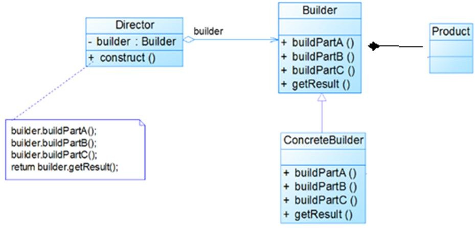

[TOC]
# 建造者模式

## 定义

1)	建造者模式（Builder Pattern） 又叫生成器模式，是一种对象构建模式。它可以将复杂对象的建造过程抽象出来（抽象类别），使这个抽象过程的不同实现方法可以构造出不同表现（属性）的对象。
2)	建造者模式 是一步一步创建一个复杂的对象，它允许用户只通过指定复杂对象的类型和内容就可以构建它们， 用户不需要知道内部的具体构建细节。

## 建造者模式的四个角色

1)	 Product（产品角色）： 一个具体的产品对象。
2)	Builder（抽象建造者）： 创建一个 Product 对象的各个部件指定的 接口/抽象类。

3)	ConcreteBuilder（具体建造者）： 实现接口，构建和装配各个部件。
4)	Director（指挥者）： 构建一个使用 Builder 接口的对象。它主要是用于创建一个复杂的对象。它主要有两个作用，一是：隔离了客户与对象的生产过程，二是：负责控制产品对象的生产过程。



## 应用实例

1)	需要建房子：这一过程为打桩、砌墙、封顶。不管是普通房子也好，别墅也好都需要经历这些过程，下面我们使用建造者模式(Builder Pattern)来完成


第一步：我们的目标Computer类：
```java
public class Computer {
    private String cpu;//必须
    private String ram;//必须
    private int usbCount;//可选
    private String keyboard;//可选
    private String display;//可选

    public Computer(String cpu, String ram) {
        this.cpu = cpu;
        this.ram = ram;
    }
    public void setUsbCount(int usbCount) {
        this.usbCount = usbCount;
    }
    public void setKeyboard(String keyboard) {
        this.keyboard = keyboard;
    }
    public void setDisplay(String display) {
        this.display = display;
    }
    @Override
    public String toString() {
        return "Computer{" +
                "cpu='" + cpu + '\'' +
                ", ram='" + ram + '\'' +
                ", usbCount=" + usbCount +
                ", keyboard='" + keyboard + '\'' +
                ", display='" + display + '\'' +
                '}';
    }
}
```
第二步：抽象构建者类

```java
public abstract class ComputerBuilder {
    public abstract void setUsbCount();
    public abstract void setKeyboard();
    public abstract void setDisplay();

    public abstract Computer getComputer();
}
```
第三步：实体构建者类，我们可以根据要构建的产品种类产生多了实体构建者类，这里我们需要构建两种品牌的电脑，苹果电脑和联想电脑，所以我们生成了两个实体构建者类。

苹果电脑构建者类

```java
public class MacComputerBuilder extends ComputerBuilder {
    private Computer computer;
    public MacComputerBuilder(String cpu, String ram) {
        computer = new Computer(cpu, ram);
    }
    @Override
    public void setUsbCount() {
        computer.setUsbCount(2);
    }
    @Override
    public void setKeyboard() {
        computer.setKeyboard("苹果键盘");
    }
    @Override
    public void setDisplay() {
        computer.setDisplay("苹果显示器");
    }
    @Override
    public Computer getComputer() {
        return computer;
    }
}
```
联想电脑构建者类
```java
public class LenovoComputerBuilder extends ComputerBuilder {
    private Computer computer;
    public LenovoComputerBuilder(String cpu, String ram) {
        computer=new Computer(cpu,ram);
    }
    @Override
    public void setUsbCount() {
        computer.setUsbCount(4);
    }
    @Override
    public void setKeyboard() {
        computer.setKeyboard("联想键盘");
    }
    @Override
    public void setDisplay() {
        computer.setDisplay("联想显示器");
    }
    @Override
    public Computer getComputer() {
        return computer;
    }
}
```

第四步：指导者类（Director）

```java
public class ComputerDirector {
    public void makeComputer(ComputerBuilder builder){
        builder.setUsbCount();
        builder.setDisplay();
        builder.setKeyboard();
    }
}
```
使用
首先生成一个director (1)，然后生成一个目标builder (2)，接着使用director组装builder (3),组装完毕后使用builder创建产品实例 (4)。
```java
public static void main(String[] args) {
        ComputerDirector director=new ComputerDirector();//1
        ComputerBuilder builder=new MacComputerBuilder("I5处理器","三星125");//2
        director.makeComputer(builder);//3
        Computer macComputer=builder.getComputer();//4
        System.out.println("mac computer:"+macComputer.toString());

        ComputerBuilder lenovoBuilder=new LenovoComputerBuilder("I7处理器","海力士222");
        director.makeComputer(lenovoBuilder);
        Computer lenovoComputer=lenovoBuilder.getComputer();
        System.out.println("lenovo computer:"+lenovoComputer.toString());
}
```
输出结果如下：

```java
mac computer:Computer{cpu='I5处理器', ram='三星125', usbCount=2, keyboard='苹果键盘', display='苹果显示器'}
lenovo computer:Computer{cpu='I7处理器', ram='海力士222', usbCount=4, keyboard='联想键盘', display='联想显示器'}
```
可以看到，文章最开始的使用方式是传统builder模式的变种， 首先其省略了director 这个角色，将构建算法交给了client端，其次将builder 写到了要构建的产品类里面，最后采用了链式调用。

## 实例二（变种建造者模式）

当一个类的构造函数参数超过4个，而且这些参数有些是可选的时，我们通常有两种办法来构建它的对象。 例如我们现在有如下一个类计算机类Computer，其中cpu与ram是必填参数，而其他3个是可选参数，那么我们如何构造这个类的实例呢,通常有两种常用的方式：

```java
public class Computer {
    private String cpu;//必须
    private String ram;//必须
    private int usbCount;//可选
    private String keyboard;//可选
    private String display;//可选
}
```

第一种：折叠构造函数模式（telescoping constructor pattern ），这个我们经常用,如下代码所示
```java
public class Computer {
     ...
    public Computer(String cpu, String ram) {
        this(cpu, ram, 0);
    }
    public Computer(String cpu, String ram, int usbCount) {
        this(cpu, ram, usbCount, "罗技键盘");
    }
    public Computer(String cpu, String ram, int usbCount, String keyboard) {
        this(cpu, ram, usbCount, keyboard, "三星显示器");
    }
    public Computer(String cpu, String ram, int usbCount, String keyboard, String display) {
        this.cpu = cpu;
        this.ram = ram;
        this.usbCount = usbCount;
        this.keyboard = keyboard;
        this.display = display;
    }
}
```

第二种：Javabean 模式，如下所示
```java
public class Computer {
        ...

    public String getCpu() {
        return cpu;
    }
    public void setCpu(String cpu) {
        this.cpu = cpu;
    }
    public String getRam() {
        return ram;
    }
    public void setRam(String ram) {
        this.ram = ram;
    }
    public int getUsbCount() {
        return usbCount;
    }
...
}
```
那么这两种方式有什么弊端呢？

第一种主要是使用及阅读不方便。你可以想象一下，当你要调用一个类的构造函数时，你首先要决定使用哪一个，然后里面又是一堆参数，如果这些参数的类型很多又都一样，你还要搞清楚这些参数的含义，很容易就传混了。。。那酸爽谁用谁知道。

第二种方式在构建过程中对象的状态容易发生变化，造成错误。因为那个类中的属性是分步设置的，所以就容易出错。

为了解决这两个痛点，builder模式就横空出世了。


如何实现
1. 在Computer 中创建一个静态内部类 Builder，然后将Computer 中的参数都复制到Builder类中。
2. 在Computer中创建一个private的构造函数，参数为Builder类型
3. 在Builder中创建一个public的构造函数，参数为Computer中必填的那些参数，cpu 和ram。
4. 在Builder中创建设置函数，对Computer中那些可选参数进行赋值，返回值为Builder类型的实例
5. 在Builder中创建一个build()方法，在其中构建Computer的实例并返回
```java
public class Computer {
    private final String cpu;//必须
    private final String ram;//必须
    private final int usbCount;//可选
    private final String keyboard;//可选
    private final String display;//可选

    private Computer(Builder builder){
        this.cpu=builder.cpu;
        this.ram=builder.ram;
        this.usbCount=builder.usbCount;
        this.keyboard=builder.keyboard;
        this.display=builder.display;
    }
    public static class Builder{
        private String cpu;//必须
        private String ram;//必须
        private int usbCount;//可选
        private String keyboard;//可选
        private String display;//可选

        public Builder(String cup,String ram){
            this.cpu=cup;
            this.ram=ram;
        }

        public Builder setUsbCount(int usbCount) {
            this.usbCount = usbCount;
            return this;
        }
        public Builder setKeyboard(String keyboard) {
            this.keyboard = keyboard;
            return this;
        }
        public Builder setDisplay(String display) {
            this.display = display;
            return this;
        }        
        public Computer build(){
            return new Computer(this);
        }
    }
  //省略getter方法
}
```

使用：
在客户端使用链式调用，一步一步的把对象构建出来。
```java
Computer computer=new Computer.Builder("因特尔","三星")
                .setDisplay("三星24寸")
                .setKeyboard("罗技")
                .setUsbCount(2)
                .build();
```

## 注意事项

1)	客户端(使用程序)不必知道产品内部组成的细节，将产品本身与产品的创建过程解耦，使得相同的创建过程可以创建不同的产品对象

2)	每一个具体建造者都相对独立，而与其他的具体建造者无关，因此可以很方便地替换具体建造者或增加新的具体建造者， 用户使用不同的具体建造者即可得到不同的产品对象

3)	可以更加精细地控制产品的创建过程 。将复杂产品的创建步骤分解在不同的方法中，使得创建过程更加清晰， 也更方便使用程序来控制创建过程

4)	增加新的具体建造者无须修改原有类库的代码，指挥者类针对抽象建造者类编程，系统扩展方便，符合“开闭原则”

5)	建造者模式所创建的产品一般具有较多的共同点，其组成部分相似，如果产品之间的差异性很大，则不适合使用建造者模式，因此其使用范围受到一定的限制。

6)	如果产品的内部变化复杂，可能会导致需要定义很多具体建造者类来实现这种变化，导致系统变得很庞大，因此在这种情况下，要考虑是否选择建造者模式.

7)	抽象工厂模式 VS 建造者模式
抽象工厂模式实现对产品家族的创建，一个产品家族是这样的一系列产品：具有不同分类维度的产品组合，采用抽象工厂模式不需要关心构建过程，只关心什么产品由什么工厂生产即可。而建造者模式则是要求按照指定的蓝图建造产品，它的主要目的是通过组装零配件而产生一个新产品
