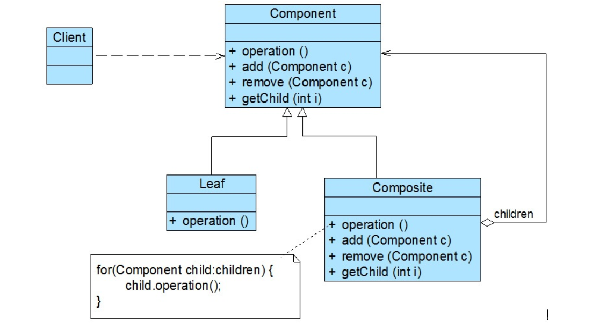
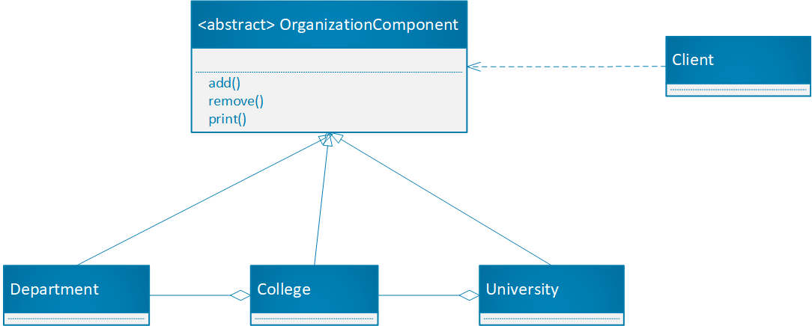

# 组合模式

## 介绍

组合多个对象形成树形结构以表示“整体-部分”的关系的层次结构。组合模式对叶子节点和容器节点的处理具有一致性，又称为整体-部分模式。



## 角色介绍

* 组合模式共分为三种角色：
1. Component(抽象构件)：叶子构件与容器构件共同继承的父类或者是共同实现的接口，该角色中包含所有子类共有方法的声明和实现，在抽象构件中定义了管理子构件的方法，新增构件、删除构件、获取构件。
2. Leaf(叶子构件)：表示叶子节点，没有子节点，对于继承父类的管理子节点的方法以抛出异常的方式处理。
3. Composite(容器构件)：表示容器节点，包含子节点，子节点可以是容器节点也可以是叶子节点，其提供一个集合来对子节点进行维护，以迭代的方式对子节点进行处理。

* 组合模式的关键是抽象构件类，它既可以表示叶子节点也可以表示容器节点，对于客户端而言是统一对抽象构件进行处理的，抽象构件类和容器构件类是聚合关联的关系，抽象构件类是容器构件类的一部分，这样容器构件类对子构件进行处理时不用区分是叶子节点还是容器节点，能够统一的做处理。

## 实例

编写程序展示一个学校的院系构成：要求在一个页面展示出学校的院系构成，一个学校有多个学院，一个学院有多个系。

**组合模式的类图：**


**代码实现：**

```java

//抽象类的实现
public abstract class OrganizationComponent {

    private String name;

    private String description;

    public OrganizationComponent(String name, String description) {
        this.name = name;
        this.description = description;
    }

    public OrganizationComponent() {
    }

    public String getName() {
        return name;
    }

    public void setName(String name) {
        this.name = name;
    }

    public String getDescription() {
        return description;
    }

    public void setDescription(String description) {
        this.description = description;
    }

    //因为叶子节点没有需要组合的对象，add方法和remove方法对他们来说是没有用的，因此不能设置为abstract让他们实现，要默认实现抛出不支持方法。
    public void add(OrganizationComponent component){
        throw new UnsupportedOperationException();
    }

    public void remove(OrganizationComponent component){
        throw new UnsupportedOperationException();
    }

    public abstract void print();
}


//University和College都属于容器节点
public class University extends OrganizationComponent{

    List<OrganizationComponent> list;

    public University(String name, String description) {
        super(name,description);
        list = new LinkedList<>();
    }

    @Override
    public void add(OrganizationComponent component) {
        list.add(component);
    }

    @Override
    public void remove(OrganizationComponent component) {
        list.remove(component);
    }

    @Override
    public void print() {
        System.out.println("-----------------" + getName()+"----------------");
        for (OrganizationComponent organizationComponent : list) {
            organizationComponent.print();
        }
    }
}

public class College extends OrganizationComponent{

    List<OrganizationComponent> list;

    public College(String name, String description) {
        super(name,description);
        list = new LinkedList<>();
    }

    @Override
    public void add(OrganizationComponent component) {
        list.add(component);
    }

    @Override
    public void remove(OrganizationComponent component) {
        list.remove(component);
    }

    @Override
    public void print() {
        System.out.println("-----------------" + getName()+"----------------");
        for (OrganizationComponent organizationComponent : list) {
            organizationComponent.print();
        }
    }
}

//Department属于叶子节点，没有add和remove方法
public class Department extends OrganizationComponent{
    public Department(String name, String description) {
        super(name, description);
    }

    public Department() {
    }

    @Override
    public void print() {
        System.out.println(super.getName());
    }
}

//测试
public class Test1 {
    public static void main(String[] args) {
        Department department1 = new Department("通信工程", "我是通信工程专业");
        Department department2 = new Department("电子与信息工程", "我是电子与信息专业");
        Department department3 = new Department("计算机科学", "我是计算机科学专业");
        Department department4 = new Department("软件工程", "我是软件工程专业");
        College college = new College("通信学院", "我是通信学院");
        college.add(department1);
        college.add(department2);
        College college1 = new College("计算机学院", "我是计算机学院");
        college1.add(department3);
        college1.add(department4);
        University university = new University("湘潭大学","我是向他大学");
        university.add(college);
        university.add(college1);
        university.print();
    }
}

//结果
-----------------湘潭大学----------------
-----------------通信学院----------------
通信工程
电子与信息工程
-----------------计算机学院----------------
计算机科学
软件工程


```
