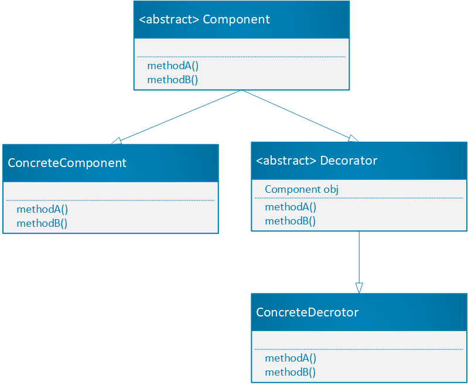
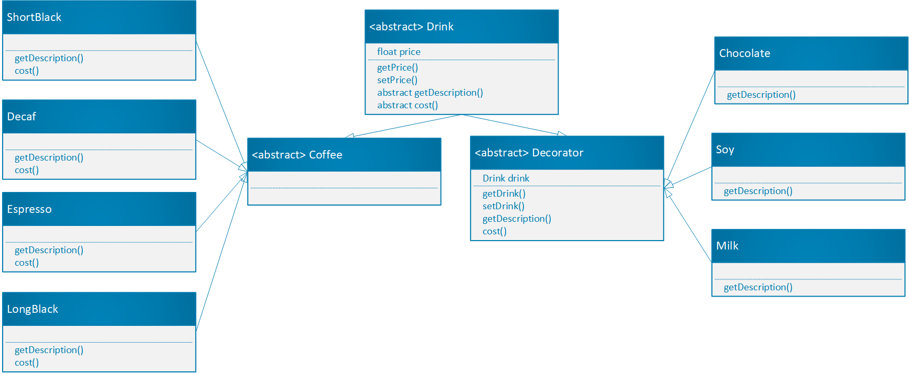
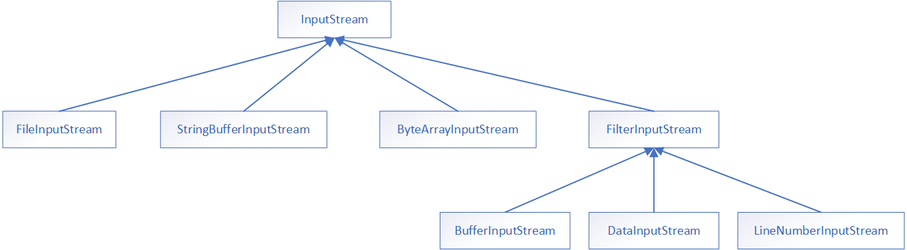

[TOC]
# 装饰者模式

## 定义

**装饰者模式** ：动态的将新功能附加到对象上。在对象功能扩展方面，它比继承更有弹性，装饰者模式也体现了开闭原则(ocp)

## 原理

通常可以使用继承来实现功能的拓展，如果这些需要拓展的功能的种类很繁多，那么势必生成很多子类，增加系统的复杂性，同时，使用继承实现功能拓展，我们必须可预见这些拓展功能，这些功能是编译时就确定了，是静态的。如果要增加功能或者修改功能我们要对原来的类进行修改不符合开闭原则并且耦合度高。

**要点： 装饰者与被装饰者拥有共同的超类，继承的目的是继承类型，而不是行为**

装饰着模式就像打包一个快递

主体（Component，被修饰者）：陶瓷，衣服，玩具等；
包装（Decorator，装饰者）：纸板，塑料袋，盒子等；

如图：装饰者和被装饰者有共同的父类，并且装饰着内部关联着被装饰者。


## 实例

**咖啡馆订单系统项目：**

1. 咖啡种类：Espresso、ShortBlack（浓缩）、LongBlack、Decaf （无糖）

2. 调料：Milk、Soy、Chocolate  （往基础品种中加入牛奶，巧克力等等，就组成了类似巧克力味咖啡，摩卡，卡夫奇诺等等。我们一般在咖啡厅一般都是直接点卡夫奇诺，其价格就是有单品咖啡和各种调料相加在一起的价格。所以下面的案例系统就是咖啡完整系统）

3. 我们要求点咖啡时，可能要加一种或者几种调料，结算的时候我们要将咖啡的钱和调料的钱一起结算。

4. 咖啡馆订单项目设计原则（或者是需求）：扩展性好、改动方便、维护方便


### 设计方案

**类图：**


**代码实现：**
```java
//装饰类和被装饰类共同的父类
public abstract class Drink {

    private float price;

    public float getPrice() {
        return price;
    }

    public void setPrice(float price) {
        this.price = price;
    }
    
    public abstract String getDescription();

    public abstract  float cost();
}


//Drink和具体的咖啡类之间的缓冲层
public abstract class Coffee extends Drink {

}

//具体的咖啡类
public class Decaf extends Coffee{

    public Decaf() {
        setPrice(5.0f);
    }

    @Override
    public String getDescription() {
        return "--Decaf咖啡--";
    }

    @Override
    public float cost() {
        return getPrice();
    }
}

//具体的咖啡类
public class Espresso extends Coffee{
    
    public Espresso() {
        setPrice(10.0f);
    }

    @Override
    public String getDescription() {
        return "--Espresso咖啡--";
    }

    @Override
    public float cost() {
        return getPrice();
    }
}

//具体的咖啡类
public class LongBlack extends Coffee{

    public LongBlack() {
        setPrice(15.0f);
    }

    @Override
    public String getDescription() {
        return "--LongBlack咖啡--";
    }

    @Override
    public float cost() {
        return getPrice();
    }
}


//具体的咖啡类
public class ShortBlack extends Coffee{

    public ShortBlack() {
        setPrice(20.0f);
    }

    @Override
    public String getDescription() {
        return "--ShortBlack咖啡--";
    }

    @Override
    public float cost() {
        return getPrice();
    }
}

//抽象的装饰类，需要具体的子类去继承此类
public abstract class Decorator extends Drink {

    private Drink drink;

    public Decorator(Drink drink) {
        this.drink = drink;
    }

    public Drink getDrink() {
        return drink;
    }

    public void setDrink(Drink drink) {
        this.drink = drink;
    }

    @Override
    public float cost() {
        return getPrice() + drink.cost();
    }
}

//调料子类，可以装饰Drink类
public class Chocolate extends Decorator{

    public Chocolate(Drink drink) {
        super(drink);
        setPrice(1.0f);
    }

    @Override
    public String getDescription() {
        String s = this.getDrink().getDescription();
        return s + "--添加配料：Chocolate--";
    }

}

//调料子类，可以装饰Drink类
public class Milk extends Decorator{
    
    public Milk(Drink drink) {
        super(drink);
        setPrice(2.0f);
    }

    @Override
    public String getDescription() {
        String s = this.getDrink().getDescription();
        return s + "--milk--";
    }
}

//调料子类，可以装饰Drink类
public class Soy extends Decorator{
    
    public Soy(Drink drink) {
        super(drink);
        setPrice(3.0f);
    }

    @Override
    public String getDescription() {
        String s = this.getDrink().getDescription();
        return s + "--soy--";
    }
}


//客户端去调用
public class CoffeeShop {
    public static void main(String[] args) {
        Drink decaf = new ShortBlack();
        System.out.println(decaf.getDescription() + decaf.cost());
        Drink chocolate = new Chocolate(decaf);
        System.out.println(chocolate.getDescription() + chocolate.cost());
        Drink soy = new Soy(chocolate);
        System.out.println(soy.getDescription() + soy.cost());
    }
}

//结果
--ShortBlack咖啡--20.0
--ShortBlack咖啡----添加配料：Chocolate--21.0
--ShortBlack咖啡----添加配料：Chocolate----添加调料：soy--24.0
```

**总结：** 我们可以看到装饰类和被装饰类是解耦的，加入我们要增加新的被装饰类（咖啡），我们只需要实现具体的咖啡类来继承Drink，如果要增加具体的调料，只需增加实现的被装饰类继承Decorator，**满足开闭原则。**


## 装饰者模式在源码中的体现



```java
public class FilterInputStream extends InputStream {
    /**
     * The input stream to be filtered.
     */
    protected volatile InputStream in;

    /**
     * Creates a <code>FilterInputStream</code>
     * by assigning the  argument <code>in</code>
     * to the field <code>this.in</code> so as
     * to remember it for later use.
     *
     * @param   in   the underlying input stream, or <code>null</code> if
     *          this instance is to be created without an underlying stream.
     */
    protected FilterInputStream(InputStream in) {
        this.in = in;
    }
}

public class test {
    public static void main(String[] args) throws FileNotFoundException {
        FileInputStream inputStream = new FileInputStream("d:\\abc.txt");
        DataInputStream dataInputStream = new DataInputStream(inputStream);
    }
}
```

FilterInputStream以及子类就是装饰类，用来装饰其它InputStream类，FileInputStream、StringBufferInputStream等是被装饰类，他们都继承了InputStream类。


