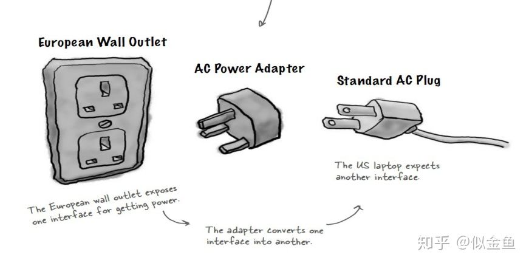
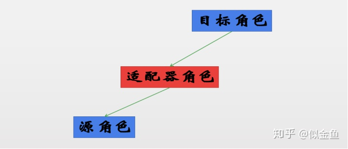
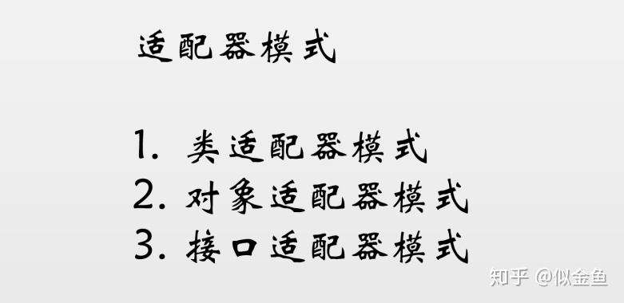
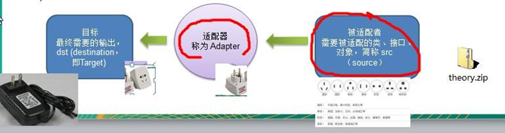
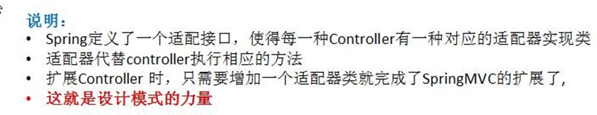
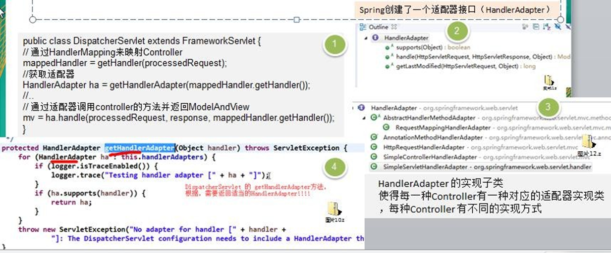
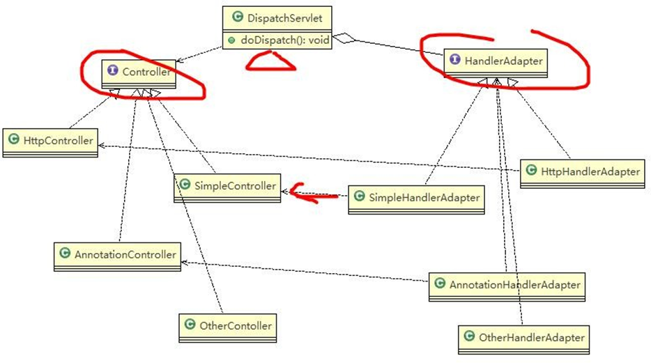

[TOC]
# 适配器模式

## 介绍
在计算机编程中，适配器模式（有时候也称包装样式或者包装）将一个类的接口适配成用户所期待的。一个适配允许通常因为接口不兼容而不能在一起工作的类工作在一起，做法是将类自己的接口包裹在一个已存在的类中。(来自百度百科)

用通俗易懂的话来形容就是：适配器模式说的是，可以把一个类的接口变换成客户端所期待的另一种接口，使得原本因接口不匹配而无法在一起工作的两个类可以一起工作。

我们在给手机充电时，连接到插座上的那个，它的学名就称之为”适配器”。其原理和我们这里所说的适配器是一样的道理，用一张图来形容就是：


Java中的适配器
在java中，适配器可以应用在很多场景中，最常见的比如我们老接口改造，但是要让它不影响旧版本项目使用，这个时候我们就可以使用适配器模式，试新版本项目可旧版本项目都可以兼容。



其过程就是通过适配器将源角色API进行适配为目标角色的API。

在java中，适配器模式一共可分为三种，分别是：类适配器模式、对象适配器模式、接口适配器模式



### 类适配器模式

类适配器模式是通过继承来实现适配功能的，代码如下：

我们先来定义一个源角色(即220V电压)

```java
public class AC220V {
    /**
     * 获取220V电压
     *
     * @return
     */
    public int output220v() {
        int output220v = 220;
        return output220v;
    }

}
```

然后我们再来定义一个目标角色(即通过适配从而获取到的5V电压)，这个地方我们定义的是一个接口

```java
public interface DC5V {

    int dc5v();

}
```

然后，我们再来定义一个适配器，适配器的作用是将220V电压转换成为5V电压。我们看看适配器的代码

```java
public class Adapter extends AC220V implements DC5V {

    @Override
    public int dc5v() {
        int output220v = output220v();
        return (output220v / 44);
    }
}
```

这里，我们的适配器，继承于源角色并且实现目标角色，这样通过实现目标角色中的方法调用源角色中的方法进行运算，从而达到适配的效果。我们编写一个测试类看看

```java
public class Test {
    @org.junit.Test
    public void test(){
        DC5V dc5V =  new Adapter();
        int dc5 = dc5V.dc5v();
        System.out.println("转换后的电压为：" + dc5 + " 伏...");
    }
}
```

从代码中我们可以看到，其实适配器做的主要工作就是为了让目标角色的API可以调用到源角色的API，适配器在中间做的是一个类似的中转作用，并且不影响源角色和目标角色原有的功能和逻辑。

由于java只支持单继承，所以这里我们的目标角色定义的是一个接口。下面我们再来看看对象适配器

#### 优缺点
1)	Java 是单继承机制，所以类适配器需要继承 src 类这一点算是一个缺点, 因为这要求 dst 必须是接口，有一定局限性;
2)	src 类的方法在 Adapter 中都会暴露出来，也增加了使用的成本。
3)	由于其继承了 src 类，所以它可以根据需求重写 src 类的方法，使得 Adapter 的灵活性增强了。

### 对象适配器
对象适配器是通过组合来实现适配器功能的，即适配器拥有源角色的实例，我们使用代码来看看：

此处源角色和目标角色两个类代码和上面是一样的，不另做介绍，我们看看适配器角色代码

```java
public class Adapter implements DC5V {

    private AC220V ac220V;

    public Adapter(AC220V ac220V) {
        this.ac220V = ac220V;
    }

    @Override
    public int dc5v() {
        int output220v = ac220V.output220v();
        return (output220v / 44);
    }
}
```

如上代码所示，我们的适配器中有一个有参构造，参数为源角色对象实例，适配器中有源角色对象实例引用，通过对象的引用我们进行适配转换。我们编写一个测试类看看

```java
public class Test {
    /**
     * 基于对象的适配器模式
     */
    @org.junit.Test
    public void test(){
        DC5V dc5V =  new Adapter(new AC220V());
        int dc5 = dc5V.dc5v();
        System.out.println("输入的电压为：" + new AC220V().output220v() + " 伏...");
        System.out.println("转换后的电压为：" + dc5 + " 伏...");
    }
}
```

如上所示，我们的测试类中在创建适配器时，传入参数为源角色实例，然后通过适配器将其转换为目标角色的API。
#### 优缺点
1)	对象适配器和类适配器其实算是同一种思想，只不过实现方式不同。
根据合成复用原则，使用组合替代继承， 所以它解决了类适配器必须继承 src 的局限性问题，也不再要求 dst
必须是接口。
2)	使用成本更低，更灵活

### 接口适配器
介绍完类适配器和对象适配器，我们再来看看接口适配器，接口适配器相对类适配器和对象适配器而言，接口适配器相对更加灵活，就好比手机适配器中的万能适配器，不管接入的是多少伏的电源，最终都能保证输出电源为5V。

我们直接上代码看看：

首先，我们先来定义一个抽象的电源，并且给予一个默认值为220V

```java
public abstract class ACV {

    public  int output(){
        return 220;
    }

}
```

然后我们再来定义具体的220V的电源

```java
public class AC220V extends ACV {
   
    @Override
    public int output() {
        return 220;
    }
}
```

我们再定义一个具体的110V电源，和220V电源一样，继承于抽象的电源类

```java
public class AC110V extends ACV {

    @Override
    public int output() {
        return 110;
    }
}
```

这样我们定义好了源角色，我们再来定义目标角色
```java

public interface DC5V {

    int dc5v();

}
```


目标角色还是一样，没有变化，我们再定义适配器角色看看

```java

public class Adapter implements DC5V {

    private ACV acv;

    public Adapter(AC220V ac220V) {
        this.acv = ac220V;
    }

    public Adapter(AC110V ac110V) {
        this.acv = ac110V;
    }

    @Override
    public int dc5v() {
        int ac = 0;
        if (acv != null) {
            ac = acv.output();
        }
        int sta = ac / 5;
        return (ac / sta);
    }
}
```

如上代码，在适配器角色中，我们定义一个抽象的电源，并且提供多个适配器角色的有参构造，通过具体源角色的实例使用抽象的电源引用，适配器类实现于目标角色并实现目标角色的方法，在方法体中，我们进行逻辑处理，将输入的电压进行适配为5V电压，从而达到万能适配的效果。

这样，不管输入的电压为多少，都能做到有效适配为最终想要的结果。

我们再编写一个测试类看一下：
```java
public class Test {

    @org.junit.Test
    public void test() {
        DC5V dc5V = new Adapter(new AC220V());
        int dc = dc5V.dc5v();
        System.out.println("输入的电压为：" + new AC220V().output() + " 伏...");
        System.out.println("转换后的电压为：" + dc + " 伏...");
    }
}
```

在测试类中，我们提供具体的源角色，然后交由适配器进行适配。

如上就是适配器模式的三种适配形式，前两种适配器相对差别比较小，仅仅是在适配器阶段有所区别，但是接口适配器相对区别就比较大了。但是其目的都是一样的，就是将原本不匹配的两者变的匹配并且不影响原有的逻辑结构。

就像我们平时看到的转换器。

那么，我们在哪些场景中可以使用适配器呢？

比如，app中有一个登录接口，现在有一个新的需求，需要记录登录用户的ip信息，这个在原有的接口中并没有这个参数，所以就需要添加一个ip的参数字段。

但是，如果直接在接口上改动，这样之前的app就会出现不兼容的情况，这个时候，就可以使用适配器模式来解决这个问题了，实现新老代码兼容。

## 优点
1)	适配器模式：将一个类的接口转换成另一种接口.让原本接口不兼容的类可以兼容
2)	从用户的角度看不到被适配者，是解耦的
3)	用户调用适配器转化出来的目标接口方法，适配器再调用被适配者的相关接口方法
4)	用户收到反馈结果，感觉只是和目标接口交互，如图


## 适配器在SpringMVC框架中的应用

1)	SpringMvc 中的 HandlerAdapter, 就使用了适配器模式
2)	SpringMVC 处理请求的流程回顾
3)	使用 HandlerAdapter 的原因分析:
可以看到处理器的类型不同，有多重实现方式，那么调用方式就不是确定的，如果需要直接调用 Controller 方法，需要调用的时候就得不断是使用 if else 来进行判断是哪一种子类然后执行。那么如果后面要扩展 Controller， 就得修改原来的代码，这样违背了 OCP 原则。






